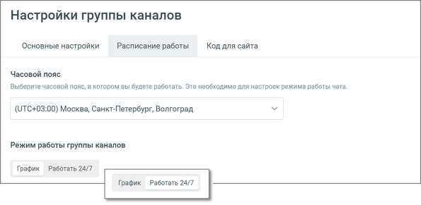
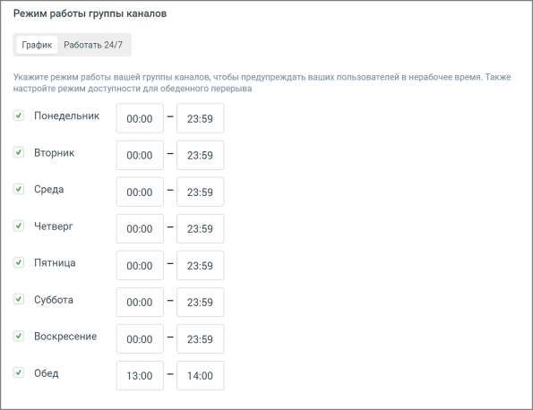
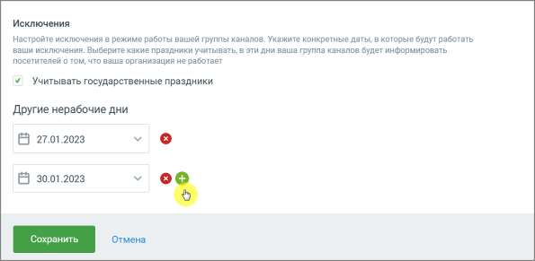

# 4.5.11.2.2.2. Расписание работы

> Трассировка: PDF §4.5.11.2.2.2 · сквозные стр. 284-287 · источники: ч.1 `kb/sources/mango-lk-manual/LK_manual_v-123.pdf` с.284-287.

В настройках расписания укажите: Часовой пояс – часовой пояс, в котором будет работать виджет. В зависимости от выбранного часового пояса определяются остальные настройки расписания виджета; Режим работы виджета: График, Работать 24/7

• График – для каждого из дней недели можно задать рабочее время.

• Работать 24/7 – круглосуточная работа без выходных

Исключения: • если чекбокс «государственные праздники» отмечен, государственные праздники считаются нерабочими днями; • другие нерабочие дни – можно добавлять/удалять дни, которые также считаются нерабочими.

ВНИМАНИЕ Настроенное на вкладке расписание будет действовать для всех каналов коммуникации.

