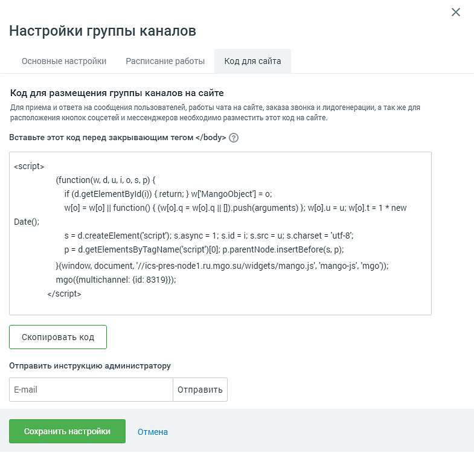

# 4.5.11.2.2.3. Код для сайта

> Трассировка: PDF §4.5.11.2.2.3 · сквозные стр. 287-288 · источники: ч.1 `kb/sources/mango-lk-manual/LK_manual_v-123.pdf` с.287-288.

В поле «Код для вставки на сайт» указан код группы каналов, который следует скопировать и вставить в код своего сайта перед закрывающим тегом </body>:

Или укажите электронную почту разработчика и нажмите «Отправить». На указанный e-mail будет выслана подробная инструкция вместе с кодом для вставки на сайт. Код для вставки на сайт можно отправить на несколько адресов электронной почты одновременно. В качестве разделителя между адресами используйте запятую. Код для вставки на сайт можно отправить на несколько адресов электронной почты одновременно. В качестве разделителя между адресами используйте запятую.

