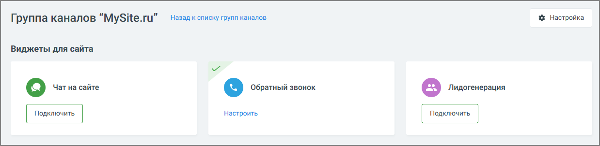
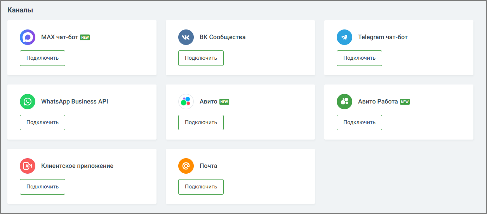

# 4.5.11.2.2. Настройка каналов коммуникации

> Трассировка: PDF §4.5.11.2.2 · сквозные стр. 290-291 · источники: ч.3 `kb/sources/mango-lk-manual/LK_manual_v-121часть-3.pdf` с.88-89.

Настройте каналы коммуникации с клиентами. Виджеты для сайта: • Заказ обратного звонка • Лидогенерация • Чат на сайте

Каналы: • MAX • Вконтакте • WhatsApp • Telegram • Клиентское приложение (по API) • E-mail • Авито • Авито Работа

