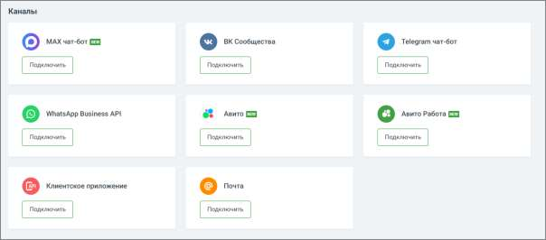

# 4.5.11.2.2. Настройка каналов коммуникации

> Трассировка: PDF §4.5.11.2.2 · сквозные стр. 288-289 · источники: ч.1 `kb/sources/mango-lk-manual/LK_manual_v-123.pdf` с.288-289.

Настройте каналы коммуникации с клиентами. Виджеты для сайта: • Заказ обратного звонка • Лидогенерация • Чат на сайте

Каналы: • MAX • Вконтакте • WhatsApp • Telegram • Клиентское приложение (по API) • E-mail • Авито • Авито Работа

