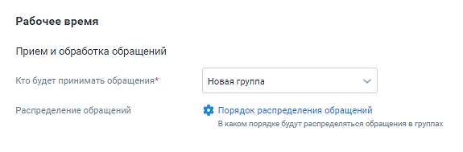
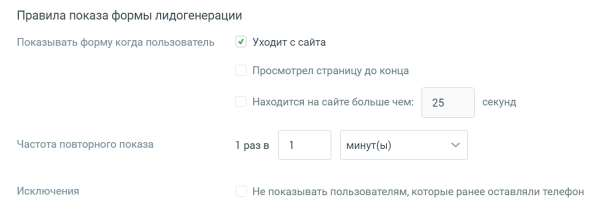
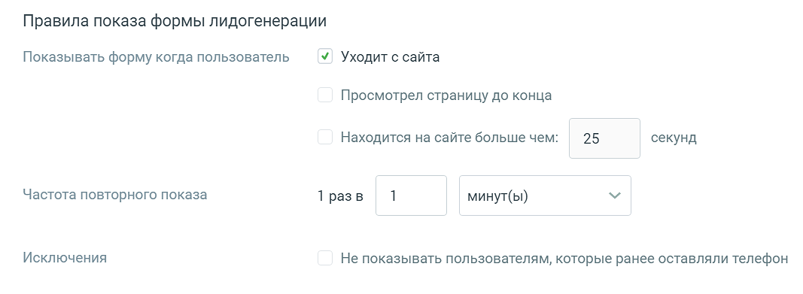
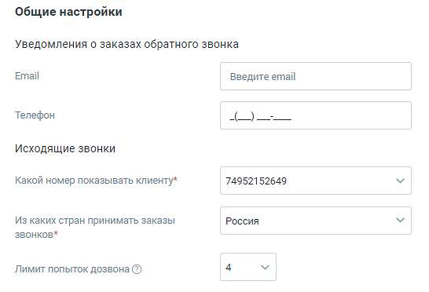
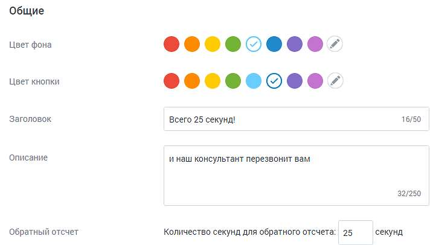
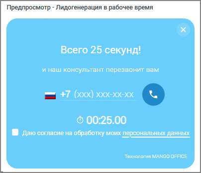

# Лидогенерация

> Трассировка: PDF §4.5.11.2.2 · сквозные стр. 293-297 · источники: ч.1 `kb/sources/mango-lk-manual/LK_manual_v-123.pdf` с.293-297.

Настройте канал коммуникации с клиентами. Виджет отображается при определенных действиях посетителя сайта. Вкладка «Настройка канала» Переходите к индивидуальным настройкам канала.

Предусмотрены следующие настройки лидогенерации в рабочее время: Прием и обработка обращений • Кто будет обрабатывать обращения – сотрудник либо группа, которые будут обрабатывать поступившие звонки. В качестве сотрудника можно выбрать чат-

бот (если в ЛК ВАТС подключена услуга «Чат-бот»). Поле обязательно для заполнения; • Распределение обращений – только для варианта «группа». Распределение обращений устанавливается в соответствующем разделе Личного кабинета пользователя ВАТС.

Правила показа формы лидогенерации • Показывать форму когда пользователь – выбор отслеживаемых действий посетителя, после которых будет показана форма лидогенерации для отправки заказа обратного звонка; • Частота повторного показа – период, через который виджет отображается повторно; • Исключения – при включенной настройке виджет не будет отображаться тем посетителям, которые указали свой номер телефона. В нерабочее время форма лидогенерации не отображается.

В блоке Общие настройки предусмотрен следующий набор настроек: Уведомления о заказах обратного звонка • E-mail – адрес электронной почты для получения уведомлений. Если включен прием обращений в нерабочее время, поле является обязательным для заполнения; • Телефон – мобильный номер телефона для получения уведомлений о заказах обратного звонка в виде SMS-сообщений. Если указать e-mail и телефон, уведомления будут приходить на оба контакта. Исходящие звонки (настройки доступны только для варианта «Использовать автовызов») • Какой номер показывать клиенту – номер телефона, который отобразится у посетителя, заказавшего звонок. Поле является обязательным для заполнения; • Из каких стран принимать заказы звонков – ограничения на направления исходящего дозвона. По умолчанию установлены звонки только в регионе «Россия»; • Лимит попыток дозвона – максимальное количество попыток дозвона клиенту, которое осуществляет система, пока не удастся связать оператора и клиента. ВАЖНО: При дозвоне сначала система звонит оператору, потом клиенту. Лимит дозвонов до оператора – 4. Если клиент сбросит звонок, новая попытка дозвона будет осуществлена через 15 минут. Если клиент не возьмёт трубку, новая попытка дозвона будет через 100 секунд.

Вкладка «Внешний вид» Далее настройте внешний вид канала коммуникации «Лидогенерация» в рабочее время.

• Цвет фона - цвет основного окна виджета. Можно выбрать произвольный цвет,

кликнув по иконке ; • Цвет кнопки – цвет кнопки виджета. Можно выбрать произвольный цвет, кликнув

по иконке ; • Заголовок – текст размещенного на виджете заголовка; • Описание – текст, размещенный на виджете; • Обратный отсчет (количество секунд для обратного отсчета) – количество секунд, в течение которых сотрудник компании перезвонит на номер телефона посетителя сайта: ✓ Максимальное количество символов - 4 ✓ Максимальное значение - 3599 В процессе настройки меняется внешний вид виджета в окне предпросмотра.

<!-- изображение на стр. 297: байты не извлечены (PyMuPDF недоступен) -->

Сохраните настройки виджета кнопкой Сохранить. Отключить канал – после дополнительного согласия на отключение канал связи отключается. ВНИМАНИЕ На канале существует ряд ограничений (список ограничений смотрите ниже). Учитывайте это, когда знакомитесь с работой канала. Ограничения на звонки с сайта. • не более трех звонков с сайта в минуту с одного IP-адреса в рамках одного виджета. Если номер пользователя добавлен в «черный список» ВАТС, то звонок не осуществляется.
