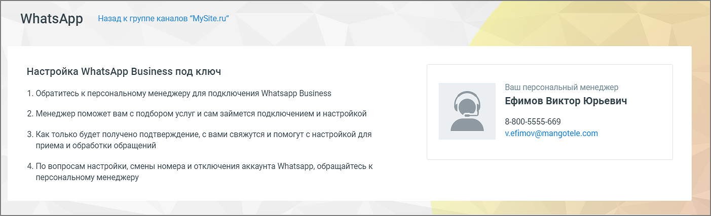
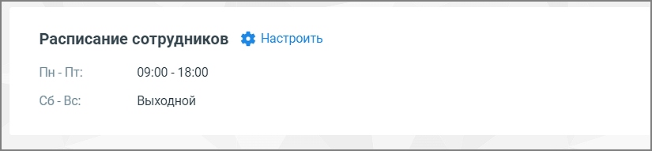
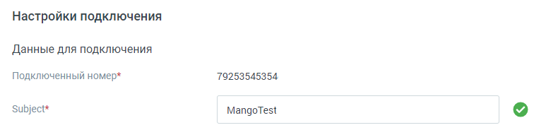
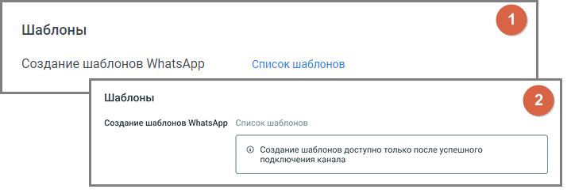
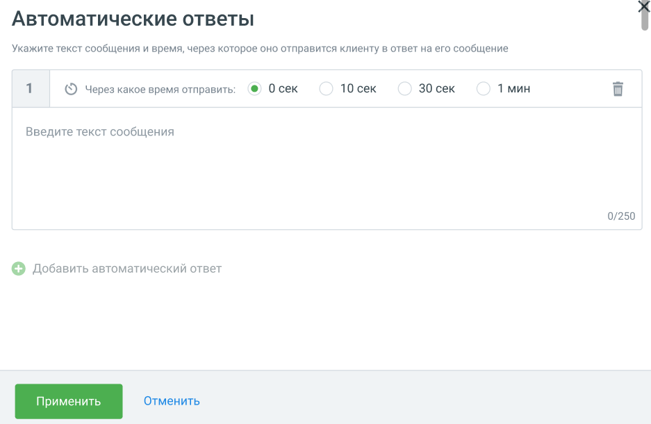

# WhatsApp

> Трассировка: PDF §4.5.11.2.2 · сквозные стр. 319-324 · источники: ч.4 `kb/sources/mango-lk-manual/LK_manual_v-121часть-4.pdf` с.16-21.

Вы можете настроить прием и отправку сообщений в мессенджере WhatsApp, обратившись к своему персональному менеджеру.

Виджет доступен только при наличии подключенной в Контакт Центре MANGO OFFICE услуги. После подключения WhatsApp необходимо произвести следующие настройки:

• Расписание сотрудников Задайте расписание работы сотрудников - настройку рабочего времени и выходных дней. Нажатие на кнопку Настроить открывает окно управления расписанием. См. раздел инструкции «Расписание работы». ВНИМАНИЕ Настроенное на вкладке расписание будет действовать для всех каналов коммуникации. Далее переходите к индивидуальным настройкам канала.

• Данные для подключения – данные для заполнения поля «Subject» предоставляет ваш персональный менеджер. Номер телефона добавляется автоматически.

1 – вид блока «Шаблоны» в ранее сохраненном канале

2 – вид блока «Шаблоны» в новом канале Шаблоны – нажатие на кнопку «Список шаблонов» открывает окно «Шаблоны WhatsApp» Личного кабинета. Здесь вы можете просмотреть список существующих шаблонов, добавить новый, архивировать существующий шаблон, отредактировать или удалить черновик шаблона. Подробнее о создании шаблонов в разделе «Шаблоны WatsApp» настоящего документа.

• Прием и обработка обращений o Кто будет принимать обращение – сотрудник, чат-бот или группа, которые будут обрабатывать поступившие звонки. При выборе варианта «группа» доступна настройка «Распределения обращений»; При выборе варианты

|  | Резервного сотрудника или группы, на |
| --- | --- |
| которых будут переводиться обращения в случае недоступности чат-бота. |  |

В списке доступны все группы и сотрудники ЛК ВАТС (включая сотрудников-роботов), а также все чат-боты модуля «Роботы MANGO OFFICE» robot.mango-office.ru. o Распределение обращений - распределение обращений устанавливается в соответствующем разделе Личного кабинета пользователя ВАТС. При подключенном чат-боте в WhatsApp можно переводить звонковые и текстовые обращения из модуля «Роботы» MANGO OFFICE, используя настроенные шаблоны WhatsApp HSM. При этом в Контакт-центре будет создано закрытое обращение с параметром: "Сотрудник": "имя чат-бота". Также при подключенном чат-боте можно настраивать кнопки быстрых ответов. Кнопки отображаются в ленте диалога пользователя, а также в Контакт-центре сотрудника, ведущего диалог. Как настраиваются кнопки чат-бота узнайте в Справке Роботов MANGO OFFICE, пункт «Задать несколько вариантов ответа» → Кнопки в тексте и Кнопки клавиатуры. • Автоматические ответы o Количество автоответов – количество настроенных для канала автоматических ответов. o Нажатие на кнопку «Настроить» открывает окно настройки автоответов.

В окне настроек необходимо ввести текст автоответа и отметить время, через которое клиент увидит автоответ в окне чата с оператором. Нажатие на кнопку «Добавить автоматический ответ» открывает окно добавления следующего автоматического ответа. Сохраните внесенные изменения кнопкой Применить.

• Показывать сообщение при закрытии обращения При активации опции «Показывать сообщение при закрытии обращения» клиенту будет отображаться установленное сообщение при завершении обращения. o Текст сообщения: Введите текст в поле под переключателем. Сообщение будет отправлено клиенту после закрытия обращения. Максимальная длина текста — 250 символов.

o Сообщение будет показано в случаях закрытия обращения оператором, автоматического завершения чат-ботом или по истечении тайм-аута. • Клиентская оценка качества Нажатие на кнопку «Настроить» открывает окно «Настройки группы каналов» для продолжения настроек оценки качества работы оператора по заданным правилам. Клиентская оценка качества будет доступна, если в Личном кабинете подключен модуль «Контроль качества». • Чекбокс «Отображать номер заявки для коллтрекинга» - позволяет включить или выключить передачу данных для сквозной аналитики динамического коллтрекинга, а также указать номер заявки и текст вопроса. o Сценарий использования: Пользователь, находясь в виджете, выбирает опцию перехода в WhatsApp, после чего переходит в приложение WhatsApp. В поле для ввода сообщения автоматически подставляется текст вопроса. ВНИМАНИЕ Для использования данной опции виджеты динамического коллтрекинга и мультиканального чата должны быть связаны между собой. Таким образом они смогут обмениваться данными. Для настройки интеграции последовательно перейдите в раздел Коллтрекинг → Обзорная панель → Блок Интеграции → «Текстовые коммуникации» и добавьте один или несколько виджетов Диалогов.

Нерабочее время Если на ВАТС подключена услуга «Чат-боты», в блоке "Нерабочее время" отображается выпадающий список доступных чат-ботов. Также в блоке настраивается возможность отправлять автоответы в нерабочее время, чтобы оставаться на связи с посетителями на сайте.

Ознакомьтесь с информационным уведомлением о правилах работы с сообщениями в нерабочее время. Невозможно одновременно использовать оба переключателя – чат-бот и автоответы. На вкладке «Общие настройки» проставьте период для автоматического завершения диалогов:

Сохранить – кликом по кнопке сохраните внесенные изменения. Отключить канал – после дополнительного согласия на отключение канал связи отключается.
