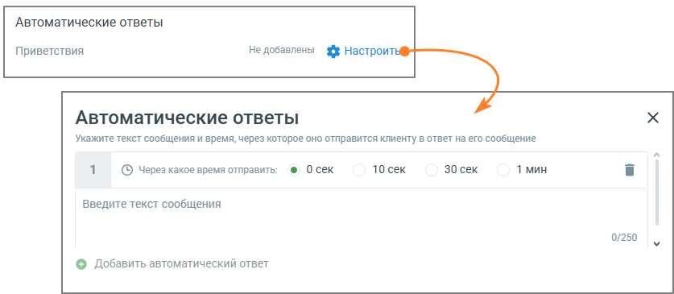

# 6. Автоматические ответы

> Трассировка: PDF §6 · сквозные стр. 326-327 · источники: ч.1 `kb/sources/mango-lk-manual/LK_manual_v-123.pdf` с.326-327.

Для повышения лояльности клиентов и удобства работы операторов следует указать один или несколько Автоматических ответов.

Рекомендуется использовать автоответы, чтобы убедить клиента дождаться ответа оператора в пиковые часы нагрузки (когда все сотрудники заняты) или когда оператор отсутствует на рабочем месте. • Автоматические ответы - нажатие на кнопку Настроить открывает окно настроек автоматического ответа; • Через какое время отправить - время с момента обращения пользователя и до отображения ему автоответа;

• Текст сообщения – максимальное количество символов 250. Пользователь может добавить несколько автоматических ответов и настроить периодичность отображения каждого. Сообщения автоответов сохраняются в истории обращения, только если пользователь написал в чате свое сообщение.
