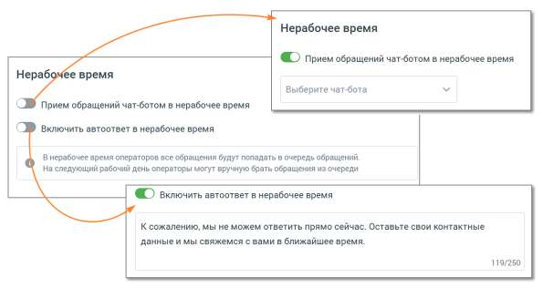

# 8. Нерабочее время

> Трассировка: PDF §8 · сквозные стр. 327-328 · источники: ч.1 `kb/sources/mango-lk-manual/LK_manual_v-123.pdf` с.327-328.

Если на ВАТС подключена услуга «Чат-боты», в блоке "Нерабочее время" отображается выпадающий список доступных чат-ботов. Также в блоке настраивается возможность отправлять автоответы в нерабочее время, чтобы оставаться на связи с посетителями на сайте.

Ознакомьтесь с информационным уведомлением о правилах работы с сообщениями в нерабочее время. Невозможно одновременно использовать оба переключателя – чат-бот и автоответы.
