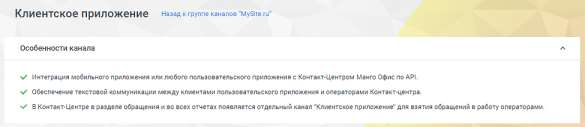
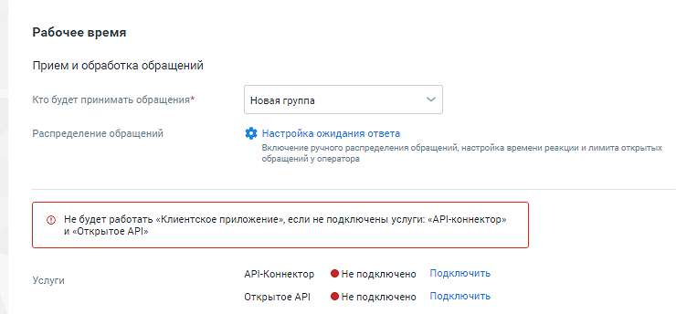
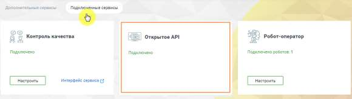

# Клиентское приложение

> Трассировка: PDF §4.5.11.2.2 · сквозные стр. 329-332 · источники: ч.1 `kb/sources/mango-lk-manual/LK_manual_v-123.pdf` с.329-332.

Перед началом настройки ознакомьтесь с особенностями канала.

В канале «Клиентское приложение» также есть возможность передавать файлы: изображение, аудио, видео, документы. Пользователь и оператор могут видеть статусы своих сообщений: набор текста, отправляется, отправлено, не отправлено с ошибкой, доставлено, прочитано.

Далее переходите к индивидуальным настройкам канала. Для рабочего времени на вкладке указываются: • Прием и обработка обращений o Кто будет принимать обращение – сотрудник, чат-бот или группа, которые будут обрабатывать поступившие звонки. При выборе варианта «группа» доступна настройка «Распределение обращений». Если чекбокс «Резервный сотрудник или группа» отмечен, на них будут отправляться сообщения при недоступности чат-бота; o Распределение обращений - распределение обращений и настройки ожидания ответа устанавливаются в соответствующих разделах Личного кабинета пользователя ВАТС. • Услуги – для корректной работы канала необходимо подключить обе услуги. После подключения иконка статуса услуги изменит цвет на зеленый. o API-Коннектор – нажатие на кнопку Подключить открывает окно Интеграции/ API коннектор в Личном кабинете пользователя ВАТС. Подробнее о подключении API коннектора узнайте в разделе «API Коннектор». o Открытое API – нажатие на кнопку Подключить открывает окно подключения сервисов Контакт-центра. После подключения услуга будет отображаться на вкладке «Подключенные сервисы».

Для получения дополнительных сведений смотрите Руководство по API MANGO OFFICE. Клиентская оценка качества – нажатие на кнопку «Настроить» открывает окно «Настройки группы каналов» для продолжения настроек оценки качества работы оператора по заданным правилам. Клиентская оценка качества будет доступна, если в Личном кабинете подключен модуль «Контроль качества». Нерабочее время Если на ВАТС подключена услуга «Чат-боты», в блоке "Нерабочее время" отображается выпадающий список доступных чат-ботов. Также в блоке настраивается возможность отправлять автоответы в нерабочее время, чтобы оставаться на связи с посетителями на сайте.

Если переключатели оставить в положении «выключено», то все обращения попадут в очередь обращений, с последующей ручной обработкой оператором.

На вкладке «Общие настройки» проставьте период для автоматического завершения диалогов: • Автоматическое завершение диалогов o Закрывать неактивный диалог через – время в часах или днях, по истечении которого обращение автоматически закрывается. Значение поля должно быть больше нуля. Сохранить – кликом по кнопке сохраните внесенные изменения. Отключить канал – после дополнительного согласия на отключение канал связи отключается.
