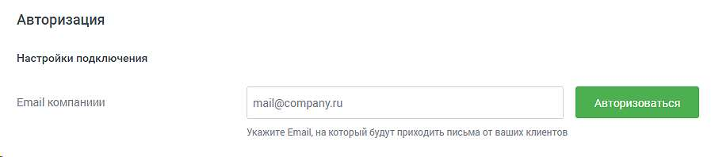
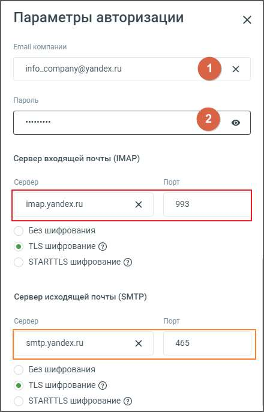

# Е-mail

> Трассировка: PDF §4.5.11.2.2 · сквозные стр. 332-335 · источники: ч.1 `kb/sources/mango-lk-manual/LK_manual_v-123.pdf` с.332-335.

В данном блоке осуществляется настройка приема сообщений, которые клиенты отправляют на электронную почту компании. Переходите к индивидуальным настройкам канала.

Для подключения канала e-mail следует указать: • Настройки подключения o E-mail компании – в данном поле необходимо указать электронную почту компании и авторизовать её. Для этого, после ввода адреса почты, нажать «+АВТОРИЗОВАТЬСЯ» и в открывшейся форме ввести данные почтового аккаунта.

ПРИМЕР: Для почтового аккаунта info_company@yandex.ru поля серверов входящей и исходящей почты должны быть заполнены следующими данными:

Где: 1 — поле для размещения адреса электронной почты. 2 — поле для размещения пароля от электронной почты.

внимание Если не удалось авторизовать указанный почтовый аккаунт, проверьте, не установлен ли для него пароль для приложений. Если такой пароль установлен, то в поле (2) необходимо вводить именно его: • Пароли для внешних приложений | Яндекс ID (yandex.ru) • Пароли для внешних приложений | Mail.ru Сервис электронной почты от Google — Gmail — имеет свои особенности: письма с вложениями могут доставляться через API с задержкой от 5 до 20 минут.

• Прием и обработка обращений o Кто будет принимать обращение — сотрудник или группа, которые будут обрабатывать поступившие звонки. При выборе варианта «группа» доступна настройка «Распределение обращений»; o Распределение обращений — настройки распределения обращений устанавливаются в соответствующих разделах Личного кабинета пользователя ВАТС.

На данном этапе можно выбрать, с какого Email сотрудники будут отправлять ответы клиентам: o С Email компании — сотрудники будут отвечать с общего адреса компании. o С рабочего Email сотрудника — сотрудники будут отправлять ответы с индивидуального рабочего адреса, указанного в настройках Контакт-центра. Чтобы выбрать этот вариант, необходимо предварительно настроить Email сотрудника в Контакт-центре. В поле «Подпись» можно задать текст, который будет автоматически добавляться в конце каждого отправленного письма. Максимальное количество символов в подписи — 500.

В разделе «Общие настройки» проставьте период для автоматического завершения диалогов: • Автоматическое завершение диалогов o Закрывать неактивный диалог через — время в часах или днях, по истечении которого обращение автоматически закрывается. Значение поля должно быть больше нуля. При создании виджета доступна опция «Каждое входящее письмо — новое обращение». При активации данной настройки для каждого входящего сообщения будет создаваться отдельное новое обращение, а предыдущая переписка будет автоматически включаться в тело письма при ответе. совет Для подключения данной опции обратитесь к Персональному менеджеру. Сохранить – кликом по кнопке сохраните внесенные изменения. Отключить канал – после дополнительного согласия на отключение канал связи отключается.
