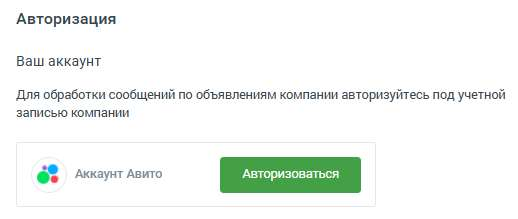
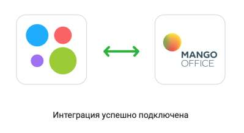
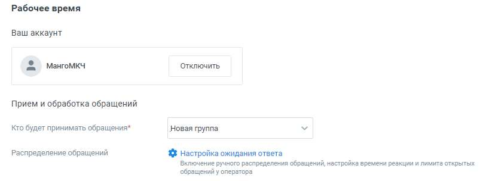

# Aвито

> Трассировка: PDF §4.5.11.2.2 · сквозные стр. 335-339 · источники: ч.1 `kb/sources/mango-lk-manual/LK_manual_v-123.pdf` с.335-339.

Вы можете настроить прием сообщений, которые клиенты отправляют на ваш аккаунт Авито. На канале нет возможности инициировать обращение к клиенту. Доступны только ответы на обращение клиента. Рабочее время • Ваш аккаунт Подключите свой аккаунт Aвито. Для этого нажмите «Авторизоваться».

В открывшемся окне подтвердите разрешение на доступ MANGO OFFICE к содержанию, отправке и удалению сообщений на Авито. После успешного подключения интеграции вы увидите окно.

На вкладке настроек обновится информация о подключенном аккаунте. Переходите к индивидуальным настройкам канала.

Для рабочего времени • Прием и обработка обращений o Кто будет принимать обращение – сотрудник, чат-бот или группа, которые будут обрабатывать поступившие звонки. При выборе варианта «группа» доступна настройка «Распределение обращений»; В качестве сотрудника можно выбрать чат-бот (если в ЛК ВАТС подключена услуга «Чат-бот»). В этом случае необходимо будет также выбрать резервного сотрудника или группу, на которых будут распределяться обращения в случае недоступности чат-бота. o Распределение обращений - распределение обращений и настройки ожидания ответа устанавливаются в соответствующих разделах Личного кабинета пользователя ВАТС. • Автоматические ответы

o Количество автоответов – количество настроенных для канала автоматических ответов. o Нажатие на кнопку «Настроить» открывает окно настройки автоответов.

В окне настроек необходимо ввести текст автоответа и отметить время, через которое клиент увидит автоответ в окне чата с оператором. Нажатие на кнопку «Добавить автоматический ответ» открывает окно добавления следующего автоматического ответа. Сохраните внесенные изменения кнопкой Применить.

• Показывать сообщение при закрытии обращения

При активации опции «Показывать сообщение при закрытии обращения» клиенту будет отображаться установленное сообщение при завершении обращения. o Текст сообщения: Введите текст в поле под переключателем. Сообщение будет отправлено клиенту после закрытия обращения. Максимальная длина текста — 250 символов. o Сообщение будет показано в случаях закрытия обращения оператором, автоматического завершения чат-ботом или по истечении тайм-аута. • Клиентская оценка качества Нажатие на кнопку «Настроить» открывает окно «Настройки группы каналов» для продолжения настроек оценки качества работы оператора по заданным правилам. Клиентская оценка качества будет доступна, если в Личном кабинете подключен модуль «Контроль качества». • Нерабочее время Если на ВАТС подключена услуга «Чат-боты», в блоке "Нерабочее время" отображается выпадающий список доступных чат-ботов. Также в блоке настраивается возможность отправлять автоответы в нерабочее время, чтобы оставаться на связи с посетителями на сайте.

Ознакомьтесь с информационным уведомлением о правилах работы с сообщениями в нерабочее время.

внимание Невозможно одновременно использовать оба переключателя – чат-бот и автоответы. На вкладке «Общие настройки» проставьте период для автоматического завершения диалогов:

• Автоматическое завершение диалогов o Закрывать неактивный диалог через – время в часах или днях, по истечении которого обращение автоматически закрывается. Значение поля должно быть больше нуля. Сохранить – кликом по кнопке сохраните внесенные изменения. Отключить канал – после дополнительного согласия на отключение канал связи отключается. ВНИМАНИЕ Не следует регистрировать один и тот же аккаунт Авито в разных виджетах Личного кабинета. Действующим будет только канал, созданный последним.
