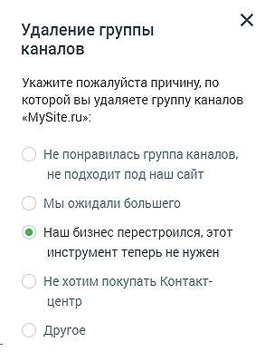

# 4.5.11.2.3. Удаление группы каналов

> Трассировка: PDF §4.5.11.2.3 · сквозные стр. 345 · источники: ч.1 `kb/sources/mango-lk-manual/LK_manual_v-123.pdf` с.345.

Для удаления группы каналов следует открыть настройки группы и щелкнуть по кнопке Удалить группу каналов. В результате на экране отобразится форма для ввода причины удаления. Заполнение формы не является обязательным.

