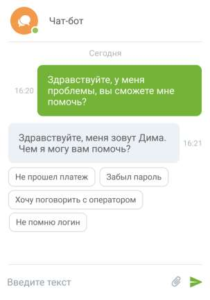

# 4.5.11.2.4. Чат-бот для групп каналов «Текстовые коммуникации»

> Трассировка: PDF §4.5.11.2.4 · сквозные стр. 345-346 · источники: ч.1 `kb/sources/mango-lk-manual/LK_manual_v-123.pdf` с.345-346.

Чат-бот «Текстовые коммуникации» – это текстовый бот для общения с клиентом в группах каналов коммуникации. Чат-бот может обрабатывать обращения по одному, нескольким или всем каналам одновременно. Чат-бот может быть добавлен на прием обращений по следующим каналам: Заказ обратного звонка, Лидогенерация, Чат на сайте, Вконтакте, WhatsApp, Telegram, Авито и Авито Работа, Клиентское приложение. Добавление чат-бота осуществляется отдельно для каждого канала. Подключение чат-ботов и создание скриптов чат-ботов осуществляется в модуле «Роботы MANGO OFFICE» robot.mango-office.ru. После подключения чат-бот появится

в общем списке сотрудников ЛК ВАТС с иконкой . При необходимости можно запросить помощь в подключении чат-бота у персонального менеджера.

При авторизации в модуле «Роботы MANGO OFFICE» robot.mango-office.ru используйте пару «логин-пароль» от Личного кабинета ВАТС. Как настраиваются кнопки чат-бота узнайте в Справке Роботов MANGO OFFICE, пункт «Задать несколько вариантов ответа» → Кнопки в тексте и Кнопки клавиатуры Пример работы чат-бота в виджете «Чата на сайте». Клиент может выбирать ответы из вариантов, заданных в скрипте чат-бота.

