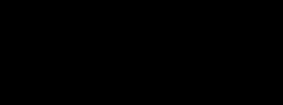
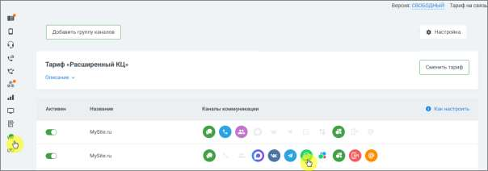
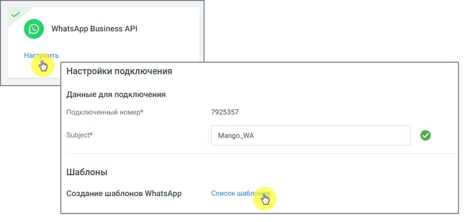
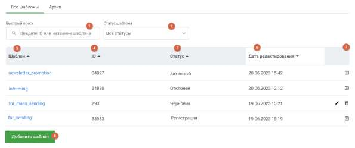
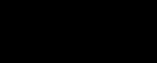
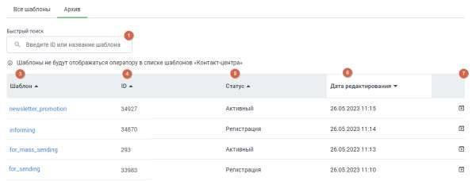

# 4.5.11.2.5. Шаблоны WhatsApp

> Трассировка: PDF §4.5.11.2.5 · сквозные стр. 346-349 · источники: ч.1 `kb/sources/mango-lk-manual/LK_manual_v-123.pdf` с.346-349.

Мессенджер WhatsApp ограничивает возможность инициировать обращение к клиенту. Написать клиенту первым можно только с помощью HSM-сообщения, которое имеет строго установленную форму – HSM-шаблон. Сообщения на основе шаблонов можно отправлять как одному конкретному человеку, так и в массовой рассылке по базе номеров, а также использовать в автоматических воронках продаж. Первичное обращение к клиенту оплачивается согласно тарифам компании. Его стоимость зависит от категории шаблона и страны получателя. Последующие сообщения клиенту той же категории будут бесплатны в течение 24 часов после последнего ответа клиента.

Пример: Клиенту отправлено оплачиваемое HSM-сообщение категории «Маркетинговые сообщения». Клиент ответил на это сообщение. С момента ответа клиента в течение 24 часов все HSM-сообщения сотрудника категории «Маркетинговые сообщения» или ответы в свободной форме (без шаблона) сотрудника этому клиенту не оплачиваются. Каждый последний ответ клиента возобновляет бесплатный период на 24 часа. Однако если этому же клиенту будет отправлено HSM-сообщение категории «Транзакционные сообщения» или «Одноразовые пароли», за такое сообщение необходимо будет заплатить. Контакт-центр MANGO OFFICE предлагает удобный функционал рассылок как для первичного обращения к клиенту, так и для последующего диалога с ним. Ваши HSM-шаблоны Чтобы просмотреть список своих HSM-шаблонов необходимо последовательно пройти в раздел «Текстовые коммуникации» → Группы каналов → Канал коммуникации → WhatsApp (Настроить) → Список шаблонов.

После клика по ссылке «Список шаблонов» откроется рабочая панель HSM-шаблонов WhatsApp. Рабочая панель HSM-шаблонов WhatsApp состоит из вкладок Все шаблоны и Архив. На вкладках отображается ключевая информация о шаблоне. Для пользователей, у которых подключен Контакт-центр MANGO OFFICE, шаблоны вкладки «Все шаблоны» в статусе «Активные» также отображаются в списке шаблонов Контакт-центра.

Рис. Вкладка «Все шаблоны»

Рис. Вкладка «Архив» Вкладки содержат следующие данные: 1. Поле полнотекстового поиска по ID или названию шаблона. 2. Фильтр по статусу шаблона. 3. Наименование шаблона. Клик по пиктограмме в заголовке сортирует список в

алфавитном порядке. 4. ID шаблона. Клик по пиктограмме в заголовке сортирует список по

<!-- изображение на стр. 349: байты не извлечены (PyMuPDF недоступен) -->

убыванию/возрастанию числа. 5. Статус шаблона – один из четырех вариантов: Активный, Отклонен, Черновик, Регистрация. Клик по пиктограмме в заголовке сортирует список в алфавитном

<!-- изображение на стр. 349: байты не извлечены (PyMuPDF недоступен) -->

порядке. 6. Дата и время редактирования шаблона. Клик по пиктограмме в заголовке

<!-- изображение на стр. 349: байты не извлечены (PyMuPDF недоступен) -->

сортирует список по убыванию/возрастанию даты. 7. Кнопки обработки шаблона. Варианты – «удалить» и «редактировать» доступны только для шаблонов в статусе «черновик». Шаблоны в прочих статусах можно архивировать или разархивировать. Клик по соответствующей пиктограмме переводит шаблон на вкладку «Архив», и обратно. 8. Кнопка «Добавить шаблон». Нажатие на кнопку открывает окно создания нового шаблона. Клик по наименованию шаблона открывает его для просмотра. Никакие действия с просматриваемым шаблоном невозможны. Шаблоны в статусе «Черновик» доступны для редактирования.
