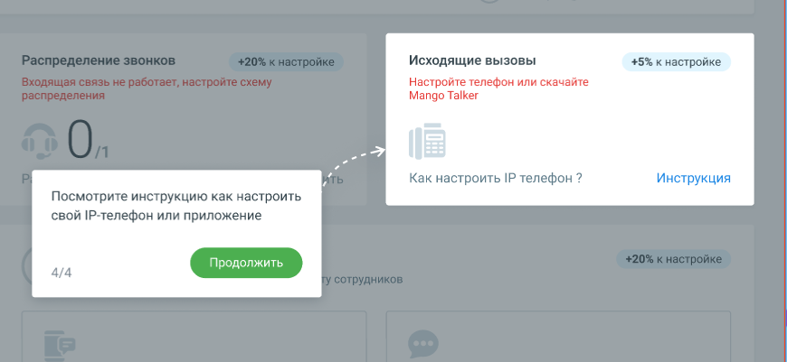

# 1.8.2.5. Блок 5. Настройка исходящих вызовов

> Трассировка: PDF §1.8.2.5 · сквозные стр. 25 · источники: ч.1 `kb/sources/mango-lk-manual/LK_manual_v-121часть-1.pdf` с.25.

Кликните по кнопке Инструкция и настройте исходящую связь посредством IP- телефонии или приложения. Если хотя бы у одного сотрудника в карточке будет задан sip-адрес, после завершения этапа шкала прогресса Онбординга увеличится на 5%. Чтобы перейти к настройке исходящих вызовов, нажмите кнопку Продолжить.
