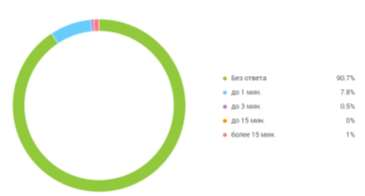
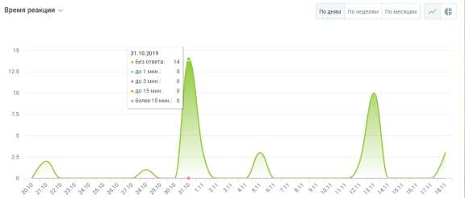

# БЛОК ВИЗУАЛИЗАЦИИ

> Трассировка: PDF §4.5.11.3.2 · сквозные стр. 356-358 · источники: ч.1 `kb/sources/mango-lk-manual/LK_manual_v-123.pdf` с.356-358.

Данные в блоке отображаются в виде графика (по умолчанию) или круговой диаграммы.

Для отчета Время реакции круговая диаграмма содержит следующую информацию: • Процент обращений, оставшихся без ответа; • процент обращений, где время реакции до 1 минуты; • процент обращений, где время реакции до 3 минут (но более 1 минуты); • процент обращений, где время реакции до 15 минут (но более 3 минут); • процент обращений, где время реакции более 15 минут.

Для переключения на график щелкните по иконке в правом верхнем углу окна. График содержит следующую информацию: • на горизонтальной оси - динамика по времени; • на вертикальной оси - количество обращений. При наведении курсора на график отображается подсказка, включающая: • число обращений на выбранную дату; • время реакции на обращения

График может отображаться в срезах: по дням, по неделям, по месяцам.

Для переключения на круговую диаграмму щелкните по иконке в правом верхнем углу окна.
