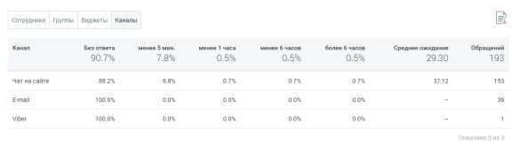

# БЛОК ТАБЛИЦЫ

> Трассировка: PDF §4.5.11.3.4 · сквозные стр. 362-363 · источники: ч.1 `kb/sources/mango-lk-manual/LK_manual_v-123.pdf` с.362-363.

Таблица формируется по срезам: • Сотрудники • Группы • Виджеты • Каналы

Таблица включает следующие данные: • Наименование среза - в данном примере срезом выбран канал; • Процент обработанных обращений в зависимости от времени обработки обращения. Для сортировки данных в таблице щелкните по наименованию столбца.

