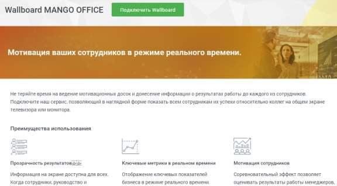
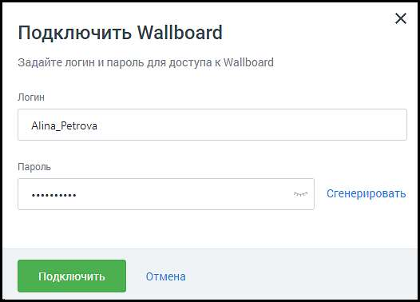
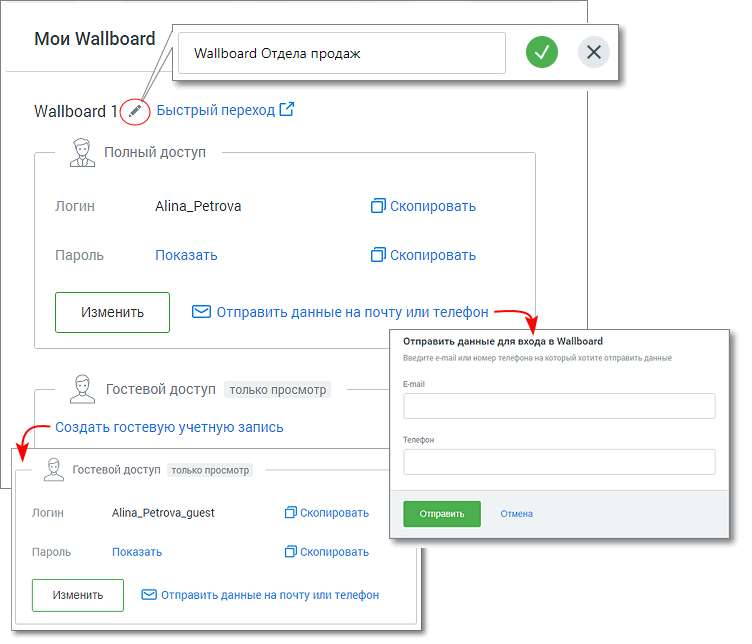

# 4.5.13. Wallboard

> Трассировка: PDF §4.5.13 · сквозные стр. 369-372 · источники: ч.1 `kb/sources/mango-lk-manual/LK_manual_v-123.pdf` с.369-372.

Доступ к разделу Wallboard есть у пользователей ВАТС с ролью Администратор. В противном случае пункт меню "Wallboard" не отображается. Модуль Wallboard отражает индивидуальные или командные рейтинги операторов, а также общие показатели подразделений в режиме реального времени. Доступ к модулю осуществляется по адресу tv.mango-office.ru.

Для подключения услуги кликните по иконке модуля в вертикальном меню Личного кабинета пользователя ВАТС. Ознакомьтесь с информацией в окне подключения, нажмите кнопку Подключить Wallboard.

Заполните поля формы создания аккаунта Wallboard. Пароль должен содержать не менее 8 символов, включать строчные, заглавные латинские буквы и цифры.

После подключения услуги иконка модуля перемещается выше, в раздел подключенных продуктов. По клику на иконку открывается окно услуги «Мой Wallboard».

В окне доступны следующие действия: • Переименование учетной записи аккаунта – для переименования кликните по пиктограмме «карандаш»; • Быстрый переход к Wallboard – по клику на ссылке открывается монитор показателей. Для новых аккаунтов – открывается окно настроек Wallboard; • Изменение данных аккаунта – для изменения данных аккаунта нажмите кнопку «Изменить»; • Копирование данных аккаунта – логин или пароль аккаунта копируются в буфер обмена; • Отправка данных аккаунта на почту или телефон; • Просмотра пароля к аккаунту; • Создание гостевой учетной записи – для каждого аккаунта может быть создана дополнительная гостевая учетная запись для доступа к Wallboard в режиме просмотра; • Изменение/удаление гостевого аккаунта - для изменения данных или удаления гостевого аккаунта нажмите кнопку «Изменить»; • Удаление учетной записи Wallboard – для удаления учетной записи кликните по кнопке «Отключить» в правом верхнем углу окно услуги «Мой Wallboard». Подтвердите свое согласие на отключение; • Подключение дополнительной учетной записи – чтобы подключить новый аккаунт Wallboard, нажмите кнопку «Подключить новый».

совет Настройки Wallboard хранятся для каждой учетной записи отдельно. Подключая две учетные записи, компания может использовать два Wallboard с разными настройками. Например, один для отдела продаж, второй для отдела обслуживания клиентов. Далее переходите к настройкам монитора показателей Wallboard.

