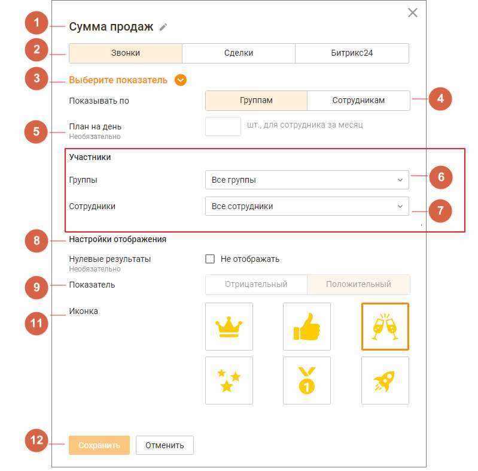

# 4.5.13.1. Настройка виджетов групповых показателей

> Трассировка: PDF §4.5.13.1 · сквозные стр. 372-373 · источники: ч.1 `kb/sources/mango-lk-manual/LK_manual_v-123.pdf` с.372-373.

Для настройки нажмите пиктограмму в правом верхнем углу окна группового виджета. Заполните следующие поля: 1. Название - наименование виджета, не более 60 символов; 2. Группа показателей - доступен выбор одной из вкладок: • "Звонки" (по умолчанию) • "Сделки" • "Битрикс24" 3. Показатель - список показателей производительности, соответствующий выбранной в п.2 группе показателей. Подробное описание показателей приведено здесь;

4. Отображение - переключатели настроек: • "по группам" - в рейтинге будут отображаться результаты групп по групповым показателям; • "по сотрудникам" - в рейтинге будут отображаться результаты сотрудников по персональным показателям; 5. План - поле для ввода значение плана для выбранного показателя. Не является обязательным для заполнения; 6-7. Участники - список групп и сотрудников ВАТС. Содержит поля: • группы; • сотрудники - доступно при выбранной в п.4 настройке отображения "По сотрудникам". Включает в себя список сотрудников ВАТС, относящихся к выбранным в поле "Группа" группам; 8. Настройки отображения: • если чекбокс проставлен - нулевые результаты будут отображаться в рейтинге; • если чекбокс не проставлен - нулевые результаты исключаются из рейтинга; 9. Показатель - характеристика показателя: отрицательный или положительный; 10. Иконка - выбранная картинка будет отображаться рядом с аватаром лидера рейтинга. Доступен выбор одной иконки; 11. Кнопки Сохранить/Отменить: • по клику на кнопку "Сохранить" внесенные изменения сохраняются; • по клику на кнопку "Отмена" внесенные изменения отменяются.
