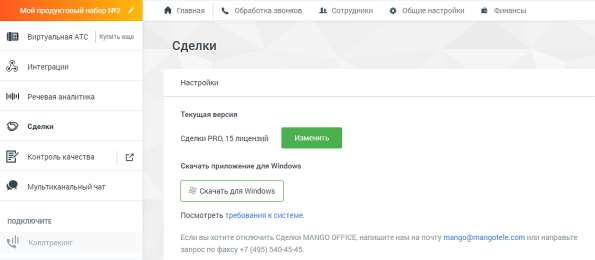

# 4.5.14. Сделки

> Трассировка: PDF §4.5.14 · сквозные стр. 382-384 · источники: ч.1 `kb/sources/mango-lk-manual/LK_manual_v-123.pdf` с.382-384.

Модуль Сделки предназначен для учета и автоматизации продаж, и доступен в двух версиях "Сделки Лайт" и "Сделки PRO".

Для подключения услуги воспользуйтесь одним из вариантов: 1) Откройте в браузере страницу Сделки MANGO OFFICE, ознакомьтесь с информацией о возможностях модуля и нажмите кнопку Подключить в одной из версий. При подключении потребуется авторизация в Личном кабинете пользователя ВАТС.

2) Щелкните по иконке модуля в вертикальном меню Личного кабинета пользователя ВАТС. После подключения услуги иконка модуля перемещается выше, в раздел подключенных продуктов. По клику на иконку открывается страница «Сделки Mango Office», с описанием текущей версии услуги, количеством приобретенных лицензий и ссылкой на скачивание приложения Контакт Центр MANGO OFFICE для Windows. Чтобы изменить текущую версию услуги, нажмите на кнопку Изменить.

Дальнейшая работа с модулем - через приложение Контакт-центр MANGO OFFICE.

Отключение услуги возможно только через личного менеджера. внимание

| Пункт главного меню «Сделки». доступен только если на ВАТС не подключен |
| --- |
| продукт « |
