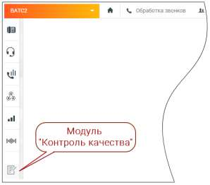

# 4.5.15. Контроль качества

> Трассировка: PDF §4.5.15 · сквозные стр. 384-385 · источники: ч.1 `kb/sources/mango-lk-manual/LK_manual_v-123.pdf` с.384-385.

Для подключения модуля Контроль качества воспользуйтесь одним из вариантов: 1) Откройте в браузере страницу Контроль качества MANGO OFFICE, ознакомьтесь с информацией о возможностях модуля и нажмите кнопку Подключить. Оставьте заявку в форме подключения. 2) Щелкните по иконке модуля в вертикальном меню Личного кабинета пользователя ВАТС.

На экране отобразятся три блока модуля: • Постзвонковая оценка - оценка работы сотрудника клиентом; • Оценка разговоров по бланкам - оценка работы сотрудника контролером; • Речевая аналитика - распознавание разговоров и поиск (вручную или автоматически) необходимой информации в разговоре. Ознакомьтесь с условиями и самостоятельно подключите блоки, кликнув по кнопкам Подключить. В дальнейшем любой из блоков может быть отключен, либо пользователем могут быть изменены условия подключения. Доступ к модулю Контроль качества MANGO OFFICE осуществляется через браузер по адресу qm.mango-office.ru.

Пользователь без прав на подключение услуг, но с правами на настройку модуля, также может использовать модуль Контроля качества. внимание Функция подключения/отключения модулей продукта «Контроль качества» доступна только администратору Лицевого счета и пользователям с правом «Управление услугами». Доступ к просмотру страницы подключения есть у всех пользователей ВАТС.
