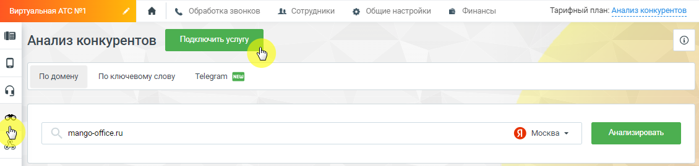
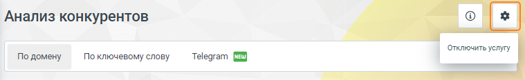

# 4.5.17. Анализ конкурентов

> Трассировка: PDF §4.5.17 · сквозные стр. 393-394 · источники: ч.4 `kb/sources/mango-lk-manual/LK_manual_v-121часть-4.pdf` с.90-91.

Анализ конкурентов – инструмент, предоставляющий данные о контекстной рекламе и органическом трафике в Яндексе, основываясь на заданном домене или ключевом слове. Основные функции "Анализа конкурентов": 1) Отслеживание активности в Яндексе: • Введите домен или ключевое слово конкурента. • Сервис проанализирует контекстную рекламу и органический трафик в Яндексе. • Получите подробные отчеты о рекламной стратегии конкурентов. 2) Анализ рекламы в Telegram: • Узнайте, какую информацию о своих товарах и услугах размещают ваши конкуренты в Telegram-каналах. • Используйте инструмент "Анализ рекламы в Telegram" для мониторинга рекламной активности конкурентов в этой популярной сети. 3) Детальные отчеты: • Получайте удобные отчеты, предоставляющие вам все необходимые данные о рекламной активности конкурентов. • Анализируйте стратегии конкурентов, выделяйте успешные подходы и формируйте свои собственные маркетинговые стратегии. 4) Сравнительный анализ: • Сравнивайте результаты своей компании с данными о рекламной активности конкурентов. • Используйте полученные знания для оптимизации своих рекламных кампаний и укрепления своего положения на рынке. Будьте оперативными и адаптируйте свои маркетинговые планы в реальном времени.

Для подключения услуги в Личном кабинете пользователя ВАТС последовательно нажмите на пиктограмму «Анализ конкурентов» в вертикальном меню, далее на кнопку Подключить услугу. Во всплывающем окне ознакомьтесь с условиями подключения на нажимте кнопку Подключить.

Для отключения услуги последовательно нажмите на пиктограмму , далее на кнопку Отключить услугу.

«Анализ конкурентов» предоставляет следующие данные: • кто ваши конкуренты по контекстной рекламе и в органической выдаче Яндекса; • какие ключевые слова используются в рекламных объявлениях конкурентов и на сколько они эффективны; • по каким запросам ваши Клиенты находят ваш сайт в органическом поиске Яндекса; • какие сторонние сайты наиболее часто встречаются в органическом поиске Яндекса по интересующему вас ключевому слову, какая у этого слова прогнозируемая цена за клик; • как менялись ключевые показатели интересующего вас сайта в течение отчетного периода. Кроме того, с помощью Сервиса можно посмотреть объявления своих конкурентов и, возможно, найти идеи для своих рекламных объявлений. Методы анализа конкурентов: • по домену • по ключевому слову • Telegram
