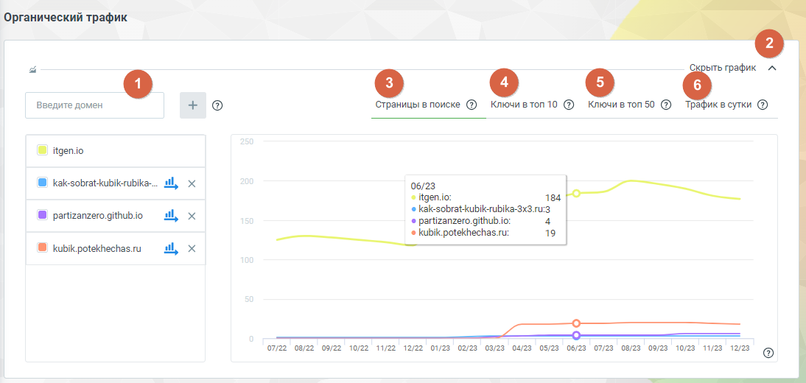
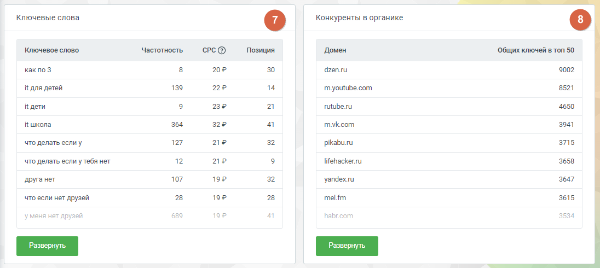

# Блок «Органический трафик»

> Трассировка: PDF §4.5.17.1 · сквозные стр. 401-404 · источники: ч.4 `kb/sources/mango-lk-manual/LK_manual_v-121часть-4.pdf` с.98-101.

Этот отчет предоставляет возможность сравнить объем органического трафика анализируемого сайта с тремя конкурирующими веб-ресурсами. По умолчанию анализируемый сайт сопоставляется с тремя конкурентными сайтами, которые наиболее схожи по однотемным ключам и сходству запросов.

Элементы блока: 1. Добавить домен. Введите несколько доменов для сравнения органического трафика. Добавленные домены будут анализироваться в соответствии с однотемными ключами и сходством запросов. 2. Пиктограмма сворачивания/разворачивания – элемент управления, позволяющий скрыть или отобразить график для удобства работы. Щелкните, чтобы уменьшить визуальный объем информации. Графики 3. Страницы в поиске – график отображает динамику изменения количества страниц сайтов, которые обнаруживаются поисковыми системами в определенный период времени. контента в поиске. 4. Ключи в топ 10 – график показывает какое количество ключевых слов из семантического ядра попало в топ 10 результатов поиска Яндекса. 5. Ключи в топ 50 – график показывает количество ключевых слов, занимающих позиции в топ 50 поисковой выдачи. 6. Трафик в сутки – график отображает динамику суточного трафика на сайте. Он может быть связан с изменениями в рейтинге ключевых слов, позициях страниц в поиске, а также с другими факторами, влияющими на количество посетителей.

7. Ключевые слова – список ключевых слов, по которым анализируемый сайт ранжируется в результатах поиска Яндекса. 8. Конкуренты в органике – сайты, которые считаются конкурентами анализируемого сайта в органической выдаче. Ключевые слова Отчет содержит список ключевых слов, по которым анализируемый сайт ранжируется в результатах поиска. Анализ этого списка помогает определить эффективность SEO- стратегии сайта и те тематики, которые привлекают внимание поисковой системы Яндекс. Нажатие на кнопку Развернуть открывает страницу отчета с детализацией. Данные, предоставляемые в детализации отчета, соответствуют данным отчета «Ключевые слова» блока «Контекстная реклама», за исключением заголовка и текста рекламного объявления. Конкуренты в органике Отчет содержит список сайтов, которые считаются конкурентами анализируемого сайта в органической выдаче. Просматривая их позиции, ключевые слова и стратегии, можно лучше понять конкурентное окружение и определить возможные улучшения в SEO- оптимизации анализируемого сайта. Нажатие на кнопку Развернуть открывает страницу отчета с детализацией. Данные, предоставляемые в детализации отчета, соответствуют данным отчета «Конкуренты в контексте» блока «Контекстная реклама», за исключением столбца «Запросов в контексте».

