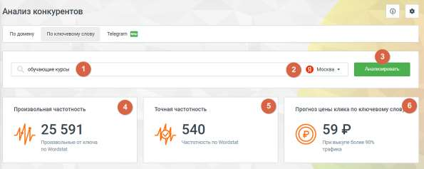
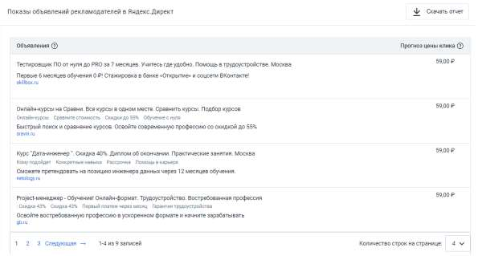
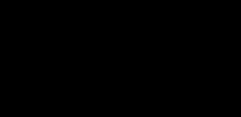
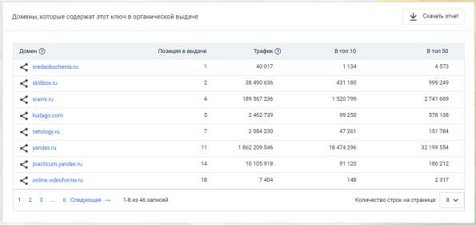

# 4.5.17.2. Анализ по ключевому слову

> Трассировка: PDF §4.5.17.2 · сквозные стр. 397-399 · источники: ч.1 `kb/sources/mango-lk-manual/LK_manual_v-123.pdf` с.397-399.

«Анализ по ключевому слову» предоставляет возможность подробного анализа поисковых запросов на основе ключевых слов. Здесь вы сможете получить информацию о том, какие ключевые слова используются вашими конкурентами в контекстной и органической рекламе, а также какие сайты наиболее активны по данным ключевым запросам.

Элементы страницы: 1. Поле ввода анализируемых ключевых слов. Введите URL сайта для получения сопоставительной информации по ключевым параметрам. 2. Выбор региона. Эта опция позволяет настроить анализ конкурентов с учетом конкретной географической территории. 3. Кнопка Анализировать – запуск процесса сбора и анализа данных, основанных на введенных параметрах. 4. Произвольная частотность – количество упоминаний запроса в различных формах, включая вариации ключевых слов и порядок слов. Эта информация основана на данных от Яндекс Wordstat. 5. Точная частотность – количество упоминаний запроса именно в той форме и порядке слов, который указан в запросе. 6. Прогноз цены клика по ключевому слову – прогнозируемая цена клика при размещении рекламы по данному запросу. Это соотношение затрат на рекламу и количество кликов на объявление. Показы объявлений в Яндекс.Директ Этот блок содержит информацию о контекстных объявлениях, найденных по данному ключевому слову.

Нажатие на кнопку Скачать отчет загружает отчет о рекламных объявлениях конкурентов в формате CSV. Домены в органической выдаче Таблица с информацией о сайтах, которые появляются в органической выдаче Яндекса по данному ключевому слову. Показывается домен, его позиция в выдаче, количество трафика, а также позиция сайта в топ 10 и топ 50 результатов поиска.

Чтобы проанализировать или перейти на сайт, указанный в отчете об исследовании по ключевому слову, выполните следующие шаги: Нажмите на домен интересующего вас сайта и выберите необходимое действие: • Анализировать домен – это действие откроет новую вкладку браузера, где будут показаны результаты исследования по выбранному вами сайту. • Перейти на сайт – при выборе этого варианта также откроется новая вкладка браузера, но уже с открытием сайта конкурента для просмотра его содержимого. Нажатие на кнопку Скачать отчет загружает отчет о доменах конкурентов в формате CSV.
