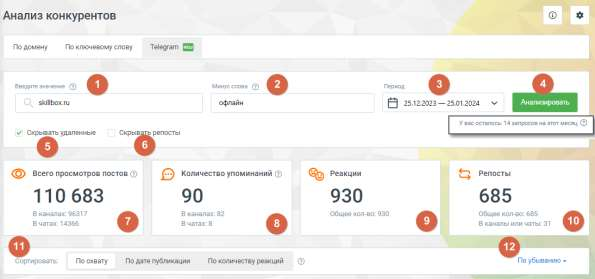
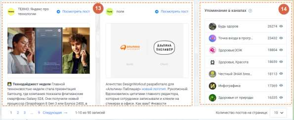

# 4.5.17.3. Telegram

> Трассировка: PDF §4.5.17.3 · сквозные стр. 399-401 · источники: ч.1 `kb/sources/mango-lk-manual/LK_manual_v-123.pdf` с.399-401.

Отчет предоставляет возможность отслеживать упоминания интересующего вас слова в постах Telegram, а также анализировать каналы и чаты, где оно упоминается, охват аудитории и реакцию пользователей на эти посты.

Элементы страницы: 1. Введите значение – слово или словосочетание, по которым будет выполнен поиск постов для создания отчета. 2. Минус слова – слова-исключения. Если слово из списка минус-слов встречается в посте, информация о таком посте не будет включена в отчет. 3. Период – временной период, за который осуществляется анализ и создание отчета. Отчет ограничен глубиной отчетного периода до трех месяцев с текущей даты. 4. Кнопка Анализировать – запуск процесса сбора и анализа данных, основанных на введенных параметрах.

5. Скрывать удаленные – при активации этого переключателя информация об удаленных постах не будет включена в отчет. 6. Скрывать репосты – при активации этого переключателя информация о репостах публикаций из других каналов также не будет включена в отчет. Отчет также ограничен количеством запросов в месяц, которое составляет 15. Превышение этого лимита ведет к начислению платы за каждый дополнительный запрос. Однако созданные ранее отчеты сохраняются в архиве сервиса и могут быть использованы повторно. 7. Всего просмотров постов – этот параметр отображает общее количество просмотров всех постов, в которых упоминается искомое слово. Он предоставляет информацию об охвате и детализируется по каналам и чатам. 8. Количество упоминаний – этот параметр указывает на общее количество постов, в которых содержится искомое слово. Он представляет собой сумму всех упоминаний слова в постах, включенных в отчет. 9. Реакции – этот параметр показывает общее количество реакций (например, лайков) по всем постам, где упомянуто искомое слово. Он отражает общую аудиторную активность к этим постам. 10. Репосты – этот параметр указывает на общее количество репостов по всем постам, в которых упоминается искомое слово. Репосты отображают, насколько часто посты распространялись другими пользователями внутри платформы Telegram. 11. Сортировать – это служебное поле позволяет пользователю управлять порядком отображения блоков с данными постов в отчете. Пользователь может выбрать один из следующих методов сортировки: • По охвату: блоки с данными будут отсортированы по уровню охвата постов. Посты с более высоким охватом будут отображаться вверху списка. • По дате публикации: блоки с данными будут отсортированы по дате публикации постов. Пользователь может выбрать порядок отображения по возрастанию или убыванию даты публикации. • По количеству реакций: блоки с данными будут отсортированы по количеству реакций (например, лайков) к постам. Посты с большим количеством реакций будут отображаться вверху списка. 12. Порядок отображения постов – пользователь имеет возможность выбрать порядок отображения постов: по возрастанию или убыванию значений параметра. Например, можно выбрать сортировку " По охвату " и порядок отображения "По убыванию", что приведет к тому, что в отчете сначала будут перечислены посты, получившие наибольший охват.

13. Блоки с данными постов – в блоке представлена информация о каждом отдельном посте, включенном в отчет. Для каждого поста указаны: • Название канала: название канала, в котором был опубликован пост. • Ссылка для просмотра поста в Telegram: прямая ссылка, которая позволяет просмотреть пост в мессенджере Telegram. • Текст поста: текст самого поста. В этом тексте выделено цветом искомое слово, которое было указано в поле "Введите значение" при создании запроса к сервису. • Параметры поста: дополнительные параметры поста, такие как количество просмотров, количество репостов, количество реакций (например, лайков), а также дата и время публикации. 14. Список каналов – блок представляет собой список каналов, в которых были найдены посты, включенные в отчет. Пользователь может видеть, в каких каналах были обнаружены посты, и управлять отображением этой информации. СОВЕТ Клик по иконке в строке с названием канала позволяет временно скрыть посты этого канала в отчете по рекламе, что может быть полезно для фокусировки на информации из определенных источников.
