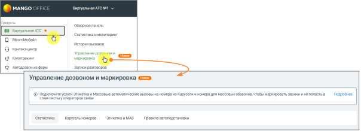

# 4.5.18. Управление дозвоном и маркировка

> Трассировка: PDF §4.5.18 · сквозные стр. 401-402 · источники: ч.1 `kb/sources/mango-lk-manual/LK_manual_v-123.pdf` с.401-402.

Раздел отображается в меню, если для текущего продукта доступна хотя бы одна из его вкладок: Статистика, Правила автоподстановки, Карусель номеров, Этикетка и МАВ. Раздел отображается в соответствии с условиями отображения каждой вкладки.

