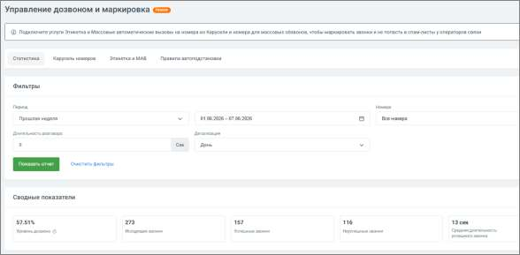
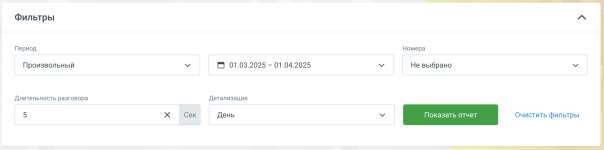
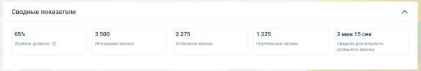
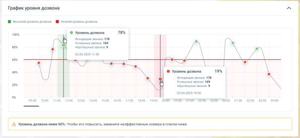
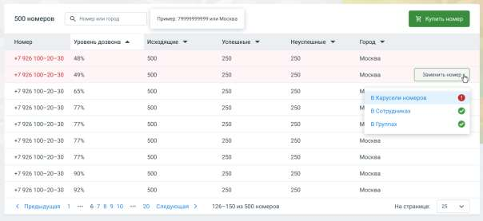

# 4.5.18.1. Статистика

> Трассировка: PDF §4.5.18.1 · сквозные стр. 402-406 · источники: ч.1 `kb/sources/mango-lk-manual/LK_manual_v-123.pdf` с.402-406.

Вкладка Статистика дозвона позволяет оперативно отслеживать показатель успешных дозвонов (ASR – Answer-Seizure Ratio).

Это ключевой инструмент для контроля эффективности исходящих обзвонов. Благодаря ему вы сможете: • Видеть, сколько из всех сделанных звонков действительно дозвонились; • Выявлять проблемы со спам-базами и низким уровнем дозвона; • Оценивать результативность обзвона по дням, группам или ролям; • Принимать решения об изменении стратегии обзвона: смене номера, времени звонков, контакт-базы и т.д.

Вкладка «Статистика» отображается всегда, но имеет разный вид в зависимости от тарифа: • Версии «Расширенная», «Максимальная», «Корпорация» (услуга «Управление дозвоном» доступна, есть хотя бы один номер) — стандартный вид со статистикой. • Все прочие версии (услуга «Управление дозвоном» недоступна) — демо-режим: «Отчёт Управление дозвоном в демо-режиме» с тестовыми данными по пяти номерам и кнопкой «Оставить заявку». Демо-режим для версий без услуги «Управление дозвоном» Если услуга «Управление дозвоном» не подключена на вашем тарифе, на вкладке отображается демо-отчёт с тестовыми данными по 5 номерам. Чтобы получить реальную статистику по вашим номерам, оставьте заявку на подключение услуги. На основной странице вы увидите: Фильтры и разрезы

• Период времени – выберите дни или диапазон. • Группа пользователей – для анализа по отделам или регионам. • Тип номера – если у вас подключено несколько исходящих номеров/сетей.

СОВЕТ Статистика доступна с 1 июля 2025 года или с даты перехода на совместимую версию Виртуальной АТС и подключения номера. Можно выбрать период до 3 месяцев из данных за последний год. Ключевые метрики

Основные метрики за выбранный период: • Уровень дозвона (ASR), % • Исходящие звонки • Успешные дозвоны • Неуспешные дозвоны • Средняя длительность успешного звонка График уровня дозвона

Показывает ASR и объем звонков во времени (день/неделя/месяц). Помогает определить, как меняется эффективность обзвона.

• Зелёные точки – высокий уровень дозвона. • Красные точки – низкий уровень (ниже 60%). • Подсказки при наведении показывают точные значения метрик. совет Используйте график для анализа времени суток, когда дозвоны наиболее успешны. Таблица номеров

В таблице содержится список номеров с показателями дозвона: • Столбцы: номер, уровень дозвона, исходящие, успешные и неуспешные. • Красным выделены номера с ASR ниже 60%. • Есть возможность заменить номер – вручную или добавить в группу «на замену». Часто задаваемые вопросы

| Вопрос | Ответ |
| --- | --- |
| Что считается успешным дозвоном? | В систему засчитывается звонок, вошедший в активную голосовую сессию клиента (не автоответчик и не занято). |
| Почему мой ASR ниже 50 %? | Возможные причины: номера попадают в спам-листы, неправильное время звонков или качественная база неактуальна. |

| Вопрос | Ответ |
| --- | --- |
| Как исправить? | Попробуйте сменить номер оператора или обзванивать в другое время, а затем проанализировать влияние на ASR. |

Как использовать статистику для принятия решений • Низкий ASR у номера? Замените номер через таблицу. Это поможет избежать попадания в спам-фильтры. • Устанавливайте цель ASR, например ≥ 70 %, и отслеживайте отклонения. • ASR падает вечером? Настройте обзвоны на более эффективное время. • Провал по всем номерам? Проверьте корректность Caller ID и поведение операторов. • Сравнивайте группы – так увидите, у кого лучше эффекты обзвона.
