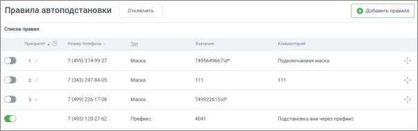

# 4.5.18.2. Правила автоподстановки

> Трассировка: PDF §4.5.18.2 · сквозные стр. 406-407 · источники: ч.1 `kb/sources/mango-lk-manual/LK_manual_v-123.pdf` с.406-407.

Функция автоподстановки позволяет автоматически выбирать номер для исходящего звонка в зависимости от заданных условий.

Чтобы создать новое правило, нажмите кнопку «Добавить правило». Откроется форма для настройки автоподстановки с учетом одного из следующих типов: • По префиксу — правило срабатывает при совпадении начальных цифр номера абонента; • По маске — используется для сопоставления с шаблоном (например, по шаблону номера телефона); • По региону — позволяет задать номер для звонков в определённые географические регионы. Все созданные правила отображаются в списке на экране. Каждое правило содержит информацию о типе, условиях применения и связанном номере. Вы можете редактировать или удалять правила при необходимости.
