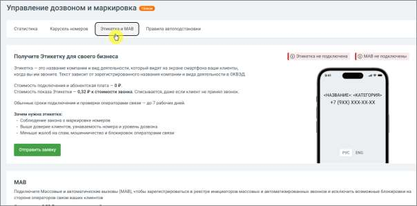
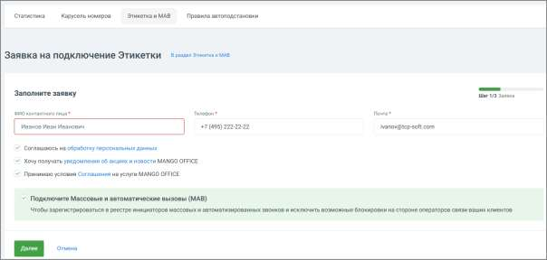
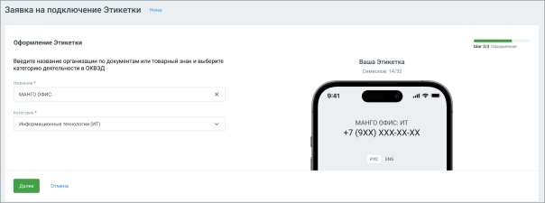
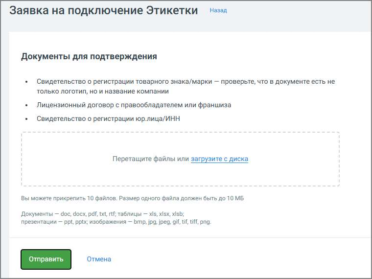

# 4.5.18.3.1. Этикетка

> Трассировка: PDF §4.5.18.3.1 · сквозные стр. 408-412 · источники: ч.1 `kb/sources/mango-lk-manual/LK_manual_v-123.pdf` с.408-412.

Этикетка — это функция, которая позволяет при исходящем звонке показать клиенту не только номер телефона, но и название вашей компании, бренд или торговую марку. Отображение происходит в сети операторов (Билайн, Мегафон, МТС) для абонентов с поддержкой VoLTE. Таким образом, когда абонент получает звонок, он видит подпись к номеру, например: «Сбербанк». Это помогает клиенту сразу понять, кто ему звонит и по какому поводу. Варианты Этикеток В ЛК ВАТС используются несколько вариантов Этикеток. Они отличаются способом формирования названия, уровнем проверки оператором связи и назначением. Выбор варианта зависит от того, как клиенты знают компанию и каким образом она использует телефонные коммуникации. Основные варианты Этикеток: • Базовая Этикетка • Персональная Этикетка

• Этикетка по товарному знаку (брендовая) Каждый вариант решает разные задачи бизнеса. Сравнение вариантов Этикеток

| Параметр | Базовая Этикетка | Персональная Этикетка | Этикетка по товарному знаку |
| --- | --- | --- | --- |
| Источник названия | Юридическое название | Пользовательское название | Бренд |
| Автоматическое создание | Да | Нет | Нет |
| Проверка оператором | Минимальная | Возможна | Обязательная |
| Скорость подключения | Быстро | Средняя | Может быть дольше |
| Использование бренда | Нет | Да | Да |

Как выбрать подходящий вариант При выборе типа Этикетки рекомендуется учитывать, как клиенты воспринимают компанию.

| Если клиенты знают компанию как | Рекомендуемый вариант |
| --- | --- |
| Юридическое название | Базовая Этикетка |
| Бренд или торговую марку | Персональная Этикетка |
| Известный зарегистрированный бренд | Этикетка по товарному знаку |

В большинстве случаев рекомендуется начинать с базовой Этикетки, поскольку она: • быстрее подключается; • не требует дополнительной проверки; • соответствует юридическим данным компании. При необходимости её можно изменить на персональную Этикетку, чтобы отображать бренд компании. Как это работает 1. Компания подключает услугу «Этикетка» и указывает название. 2. Этикетка передаётся в сеть оператора и отображается на экране смартфона клиента при входящем звонке.

3. Если клиентское устройство поддерживает VoLTE, подпись к номеру отображается автоматически. Как подключить Этикетку

Перейдите в раздел «Управление дозвоном и маркировка» → вкладка «Этикетка и МАВ» в левом вертикальном меню Личного кабинета. Здесь можно подключить услугу, подать заявку и управлять отображением этикетки. Подключение Этикетки с базовым именем Чтобы отправить заявку на подключение Этикетки с базовым именем, нажмите Отправить заявку. Ознакомьтесь с названием компании (на русском и/или латинице). Далее заполните доступные поля формы: укажите ФИО, контактный телефон или e-mail и подтвердите согласие на обработку персональных данных. Подключение Этикетки с персональным именем Нажмите Отправить заявку в блоке «Этикетка по товарному знаку». Далее: Шаг 1. Заполните доступные поля формы: укажите ФИО, контактный телефон или e-mail и подтвердите согласие на обработку персональных данных.

Шаг 2. Укажите название организации, бренда или товарного знака и вид деятельности.

Система покажет пример, как будет выглядеть Этикетка при звонке. При формировании подписей и адресов латиницей в услуге «Этикетка» используется единая система транслитерации. Шаг 3. Прикрепите подтверждающие документы (свидетельства, договоры, выписки). Поддерживается до 10 файлов в форматах pdf, doc, xls, jpg и др., размером до 10 МБ каждый.

После заполнения всех шагов заявка отправляется на проверку. Пользователь получает уведомление об успешной отправке или сообщение об ошибке. Управление и статусы • В течение одного календарного дня от одного аккаунта в ЛК ВАТС можно отправить не более 5 заявок на подключение Этикетки. Если лимит превышен, новые заявки можно подать на следующий день. • Все действия фиксируются в журнале и передаются в Яндекс.Метрику.
