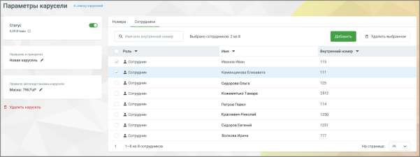

# 4.5.19.3. Редактирование карусели

> Трассировка: PDF §4.5.19.3 · сквозные стр. 417 · источники: ч.1 `kb/sources/mango-lk-manual/LK_manual_v-123.pdf` с.417.

Редактирование позволяет изменить название, номера, сотрудников и правила автоподстановки. Чтобы отредактировать карусель, нажмите в списке каруселей: ● на её название или число номеров - откроется вкладка Номера; ● на число сотрудников - откроется вкладка Сотрудники. В открывшемся окне можно изменить все параметры: название, правила автоподстановки (префикс, маска, регион), добавить или удалить сотрудников и номера, а также включить или отключить индикатор активности.

