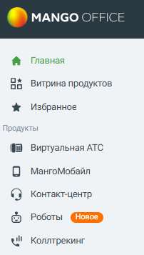
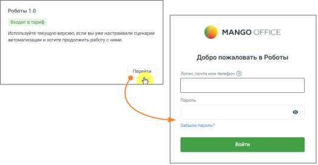

# 4.5.19. Роботы

> Трассировка: PDF §4.5.19 · сквозные стр. 434-435 · источники: ч.1 `kb/sources/mango-lk-manual/LK_manual_v-123.pdf` с.434-435.

Для перехода в раздл «Роботы» выберите соответствующую строку меню.

Если модуль не подключен, вам будетпредложено его подключить. Если подключен или входит в тариф ЛК ВАТС, клик по кнопке открывает окно аутентификации в модуле Роботы (вводите логин/пароль от ЛК ВАТС):

Больше информации о работе модуля узнайте в Руководстве пользователя «Роботы MANGO OFFICE».

