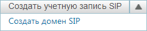
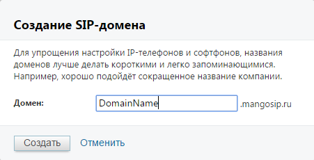
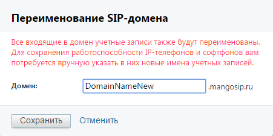
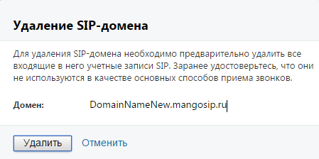
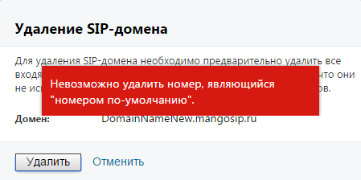
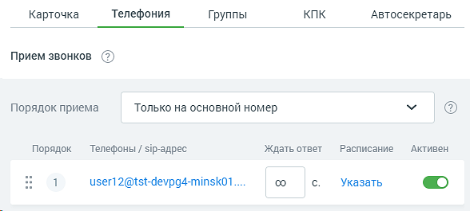

# 4.6.1.1.1. Домены SIP

> Трассировка: PDF §4.6.1.1.1 · сквозные стр. 441-444 · источники: ч.5 `kb/sources/mango-lk-manual/LK_manual_v-121часть-5.pdf` с.37-40.

Создание Для создания домена SIP выберите дополнительный пункт «Создать домен SIP» кнопки «Создать учетную запись SIP». Дополнительный пункт открывается при нажатии на стрелку справа. Вид кнопки в развернутом состоянии приведен на рисунке ниже.

В открывшейся форме введите наименование домена. При создании наименования домена соблюдайте следующие правила: первый символ должен быть буквой латинского алфавита. Минимальное количество символов - четыре. Это могут быть буквы латинского алфавита, цифры и символы "-". Регистр не учитывается.

После создания новый домен отображается в общем списке доменов. Также новый домен доступен для выбора при создании или редактировании учетной записи SIP: на данной вкладке и в карточке сотрудника. Переименование Для переименования домена нажмите «Переименовать» рядом с наименованием домена. В открывшейся форме введите новое наименование домена.

Входящие в домен учетные записи SIP получают новое наименование автоматически. Имена учетных записей, введенные в IP-телефоны и софтфоны, необходимо изменить самостоятельно. После переименования домена рекомендуем сразу же проверить их корректную работоспособность.

Удаление Для удаления домена нажмите «Удалить» рядом с наименованием домена.

При удалении выполняется проверка: входят ли в домен учетные записи SIP, являющиеся основным способом приема звонков. В случае, если хотя бы одна учетная запись SIP в карточке сотрудника указана в качестве основного способа связи, на экране будет отображено соответствующее сообщение.

Для удаления такого домена необходимо открыть карточку сотрудника на вкладке «Телефония» и указать другой основной способ связи, либо установить переключатель в колонке «Активен» напротив наименования учетной записи в положение «OFF» («Выключен»). Пример смотрите на рисунке на следующей странице.

После выполнения любого из этих действий домен доступен для удаления. внимание! При удалении домена SIP все имена и псевдонимы пользователей, связанные с этим доменом, удаляются без возможности последующего восстановления. Удаление домена mangosip.ru запрещено.
