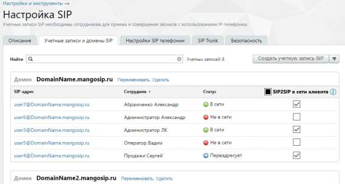

# 4.6.1.1. Учетные записи и домены SIP

> Трассировка: PDF §4.6.1.1 · сквозные стр. 435-436 · источники: ч.1 `kb/sources/mango-lk-manual/LK_manual_v-123.pdf` с.435-436.

На этой вкладке отображаются домены и учетные записи SIP, связанные с текущей виртуальной АТС. Учетные записи SIP группируются по домену. Если с учетной записью SIP связано имя пользователя Виртуальной АТС, то оно отображается в столбце «Cотрудник».

Столбец SIP2SIP в сети клиента отображается, если • на ВАТС подключена услуга «MediaProxy». • во вкладке "Внешний MediaProxy" включена настройка "Как настроено на вкладке "Учётные записи и домены SIP".

Действия, доступные на данной странице: • просмотр статуса сотрудника; • контекстный поиск записей по любому полю (SIP-адрес, сотрудник, статус); • создание, редактирование, удаление домена SIP; • создание, редактирование, удаление учетной записи SIP. Возможность создания домена SIP и учетной записи SIP доступна при редактировании карточки сотрудника в блоке настроек «Сотрудники и Группы» (подробнее в подразделе). Статусы учетных записей SIP обновляются автоматически с периодичностью не более 60 секунд. Индикаторы в столбце «Статус» обновляются поочередно для каждой записи по мере того, как системой определяется статус текущей учетной записи.
