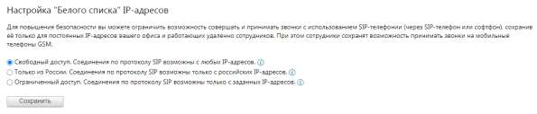
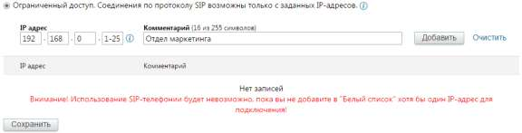

# 4.6.1.3. Безопасность

> Трассировка: PDF §4.6.1.3 · сквозные стр. 442-443 · источники: ч.1 `kb/sources/mango-lk-manual/LK_manual_v-123.pdf` с.442-443.

В целях повышения безопасности использования SIP-телефонии предусмотрено шифрование звонков. Пользователю доступны два типа шифрования: SRTP, TLS. Ознакомьтесь с условиями подключения, указанными на экране, и сохраните выбранные настройки. Блок шифрования отображается только если подключена хотя бы одна из услуг шифрования подключена или доступна для подключения на текущей версии ВАТС. При смене тарифа на тариф с невозможностью работы блока шифрования, пользователь уведомляется системным сообщением. Также в ЛК ВАТС имеется возможность настройки «белого списка» IP-адресов. На этой странице вы можете задать список IP-адресов сотрудников, с которых будет разрешен доступ к использованию учетных записей SIP.

Предусмотрено три типа доступа. Свободный доступ – наименее безопасный способ. Этот тип используется, как правило, в тех случаях, когда интернет-канал вашего офиса имеет динамический IP- адрес, большинство сотрудников работает удаленно, либо сотрудникам требуется

регулярно подключаться по SIP из различных мест, в частности через сети Wi-Fi общего использования. Только из России – высокий уровень безопасности, в то же время позволяющий сохранить мобильность сотрудников в пределах страны. Список IP-адресов в пределах России формируется автоматически, необходимости в ручной настройке нет. Ограниченный доступ – максимальный уровень безопасности. Доступ разрешен только с указанных IP-адресов. При выборе этого варианта заполните дополнительные поля:

Подробнее о диапазонах и символах групповой замены Для указания диапазонов IP-адресов используется символ «-». Например, ввод диапазона 192.168.1.16–32 равносилен указанию отдельных IP-адресов с 192.168.1.16 по 192.168.1.32 (включительно). Символ групповой замены «*» может заменять произвольное число IP-адресов (в соответствии с сегментом, где введен этот символ). Например, ввод маски 192.168.* равносилен указанию отдельных IP-адресов с 192.168.0.0 по 192.168.255.255 включительно. совет Можно использовать только один символ «-» или «*» в каждом сегменте поля IP- адрес. При вводе символа «-» или «*» в любом из сегментов поля IP-адрес последующие его сегменты становятся недоступными для ввода. Не забудьте сохранить изменения.
