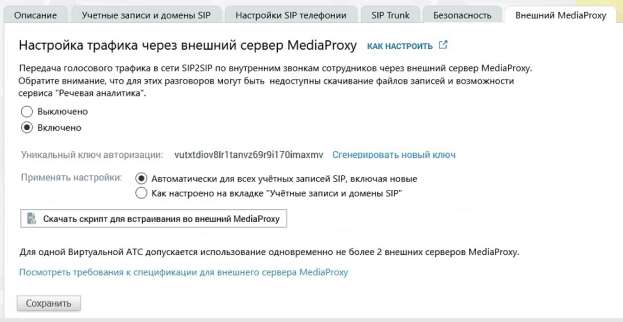

# 4.6.1.5. Внешний MediaProxy

> Трассировка: PDF §4.6.1.5 · сквозные стр. 444-446 · источники: ч.1 `kb/sources/mango-lk-manual/LK_manual_v-123.pdf` с.444-446.

Вкладка предназначена для настройки передачи трафика через внешний сервер MediaProxy. Настройки отображаются, если в Личном кабинете пользователя ВАТС подключена соответствующая услуга. Для подключения необходимо связаться с персональным менеджером. внимание Вкладка доступна для пользователей с текущей ролью «Администратор», а также для пользователей, которым предоставлены соответствующие права.

При включенной услуге окно настроек содержит: Уникальный ключ авторизации – авторизация для внешнего MediaProxy производится по ключу, который генерируется автоматически. Применять настройки: • «Автоматически для всех учётных записей SIP, включая новые» – если кнопка включена, то для всех учётных записей SIP, включая новые, внутренний голосовой трафик SIP2SIP проксируется внешним сервером MediaProxy на стороне клиента. • «Как настроено на вкладке "Учётные записи и домены SIP"» – если кнопка включена, голосовой трафик SIP2SIP по внутренним звонкам пользователей проксируется через внешний сервер MediaProxy только по разговорам с/на номера SIP-учёток, для которых включены чекбоксы в поле "SIP2SIP в сети клиента" в разделе "Учётные записи и домены SIP".

ПРИМЕР Если в настройках для SIP-учётных записей А и Б звонки проксируются внешним MediaProxy, а для В и Г – не проксируются, то:

| → |
| --- |
| → |

| → |
| --- |
| → |

• Звонки А/Б→В/Г и В/Г→А/Б проксируются как через MediaProxy MANGO OFFICE, так и через внешний MediaProxy. Скачать скрипт для встраивания во внешний MediaProxy – скачать скрипт с ключом авторизации и необходимыми техническими настройками для встраивания во внешний сервер MediaProxy. Требования к оборудованию: Для возможности осуществления 50-ти разговоров одновременно, понадобятся (необходимый минимум): • CPU – двухъядерный процессор с двумя потоками, аналогичные ядрам Intel® Xeon® E5-2640 v4 (к примеру, Intel® Xeon® Processor E5-1607 v4) • 8 GB RAM • 20 GB HDD В случае отказа работы внешнего MediaProxy пользователю необходимо отключить услугу. После отключения трафик маршрутизируется через MediaProxy MANGO OFFICE.

