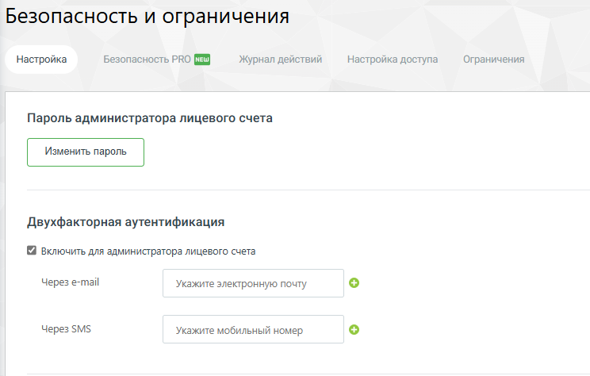
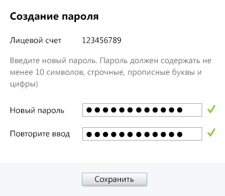

# 4.6.3.1. Настройка

> Трассировка: PDF §4.6.3.1 · сквозные стр. 454-458 · источники: ч.5 `kb/sources/mango-lk-manual/LK_manual_v-121часть-5.pdf` с.50-54.

Вкладка предоставляет возможность смены пароля, настройки двухфакторной аутентификации, исходящих вызовов и SIP.

Пароль администратора ЛС Для изменения пароля администратора щелкните по ссылке «Сменить пароль главного администратора». Подтвердите отправку письма на зарегистрированный E-mail. На указанный E-mail отправляется письмо с уникальной одноразовой ссылкой для восстановления пароля и инструкцией. Ссылка действительна в течение 24 часов. Пароль по ссылке можно поменять только один раз. При щелчке по ссылке в браузере будет открыта страница с формой установки нового пароля.

Укажите новый пароль, соблюдая указанные критерии надежности. После заполнения полей нажмите Сохранить. После инициации смены пароля администратором лицевого счета при первом входе в Личный кабинет отображается форма ввода двухфакторной аутентификации. Код верификации формируется и отправляется на e-mail, указанный при регистрации Лицевого счета. Важные замечания: Смена пароля: Пользователь может сменить свой текущий пароль самостоятельно, вводя текущий пароль для подтверждения. Никто, кроме пользователя, не может сменить его пароль. Доступность функции: Возможность сброса паролей доступна только клиентам с соответствующей услугой. Двухфакторная аутентификация • Чекбокс «Включить для администратора лицевого счета». Если чекбокс отмечен для администратора лицевого счета включена двухфакторная аутентификация. Метод получения кода аутентификации: o Через e-mail: на указанную электронную почту администратора лицевого счета, одну или несколько. o Через SMS: на указанный мобильный номер администратора лицевого счета, один или несколько. При выборе метода получения кода следует учесть, что отправка SMS является платной услугой и зависит от номера региона получателя. Для сотрудников двухфакторная аутентификация и другие параметры безопасности настраиваются на вкладке Безопасность PRO. Исходящие вызовы и SIP Разрешенные направления исходящих вызовов Проставляя галочки в соответствующих пунктах, можно указать направления, на которые вашим сотрудникам не запрещено звонить с помощью текущей Виртуальной АТС. Это способно снизить вероятность нецелевого расходования средств: работники смогут делать вызовы только на номера, необходимые для выполнения должностных обязанностей. По умолчанию позволяется звонить на любые направления. Если включен параметр «Все» (пункт отмечен галочкой), то вызовы можно делать куда угодно, если выключен — только по России. Также можно указать направления отдельно для каждого сотрудника в его профиле.

Использование команд ВАТС, набираемых в тоновом режиме: • Разрешать перевод звонка на произвольный внешний номер По умолчанию перевод разрешен, в том числе междугородный и международный. Если снять галочку, то поступившие работникам звонки можно будет переадресовать только на внутренние номера сотрудников и групп. внимание Вызовы, переадресованные на внешние для Виртуальной АТС номера, тарифицируются как исходящие звонки. • Игнорировать команды DTMF на время разговора Если в этом пункте установить галочку, то ответивший на звонок сотрудник после поднятия трубки не сможет ввести во время разговора команды с клавиатуры телефонного аппарата (например, для создания конференции или перевода вызова на другой номер). • Разрешить перехват групповых вызовов Включение данной опции позволяет сотруднику с помощью DTMF команды *8 перехватить вызов, поступивший на группу, но распределившийся на другого сотрудника. При этом перехватываются звонки во всех группах, в которых состоит сотрудник. Если таких звонков несколько, выбирается звонок, находящийся в режиме дозвона дольше всего. • Разрешить перехват индивидуальных вызовов Включение данной опции позволяет сотруднику с помощью DTMF команды *8*<внутренний номер> перехватить вызов, поступивший на сотрудника или конкретную группу. Если таких звонков несколько, выбирается звонок, находящийся дольше всего в режиме дозвона. • Разрешить перехват вызова с помощью BLF BLF (Busy Lamp Field) – это функция SIP-телефонов, которая позволяет отслеживать текущее состояние линий других абонентов вашей Виртуальной АТС с помощью светящихся индикаторов. При установленном флаге разрешается перехват вызовов при помощи кнопки BLF. Подробное описание самой функции, а также перечень моделей телефонов, поддерживающих функцию и инструкции по их настройке, смотрите на сайте. • Уведомлять сотрудников о возможностях МТ по E-mail При установленном флаге на E-mail сотрудника, указанный в его карточке, будет отправлено сообщение, содержащее ссылку на установление софтфона M. Talker.

Отправка сообщения на указанный адрес выполняется каждый раз после того, как администратор либо другой пользователь с соответствующей ролью заполнил пустое поле E-mail и нажал кнопку Сохранить в карточке сотрудника. Уведомления администратору лицевого счёта Блок используется для настройки уведомлений администратору о действиях сотрудников в продуктах MANGO OFFICE. Доступны следующие параметры: • получение уведомлений об авторизации сотрудников; • выбор сотрудников, по которым необходимо получать уведомления; • указание адреса электронной почты для получения уведомлений; • получение уведомлений при входе сотрудника с нового устройства. Уведомления позволяют администратору контролировать активность пользователей и оперативно реагировать на подозрительные или нестандартные действия.
