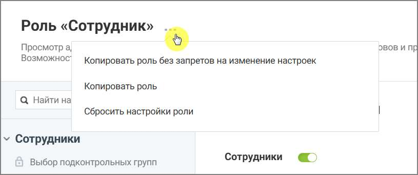
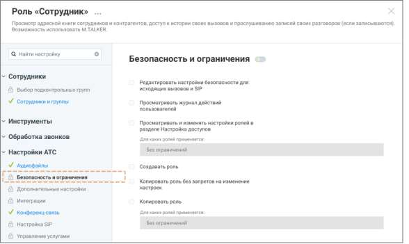
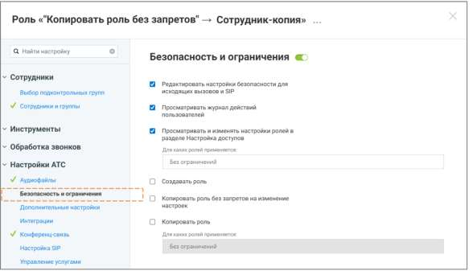
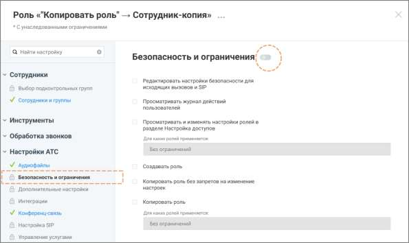

# 4.6.3.3.3. Создание роли путем копирования

> Трассировка: PDF §4.6.3.3.3 · сквозные стр. 456-459 · источники: ч.1 `kb/sources/mango-lk-manual/LK_manual_v-123.pdf` с.456-459.

Новые роли можно создавать путем копирования существующих ролей.

Рисунок 2. Создание новой роли на основе существующей Копировать роль без запретов на изменение настроек Данная строка меню доступна для нажатия если у пользователя активировано право доступа «Копировать роль без запретов на изменение настроек». внимание Важно понимать: копия роли наследует от источника только перечень доступных разделов. Если раздел был закрыт/открыт для исходной роли, после создания копии он останется аналогично закрытым/открытым, с возможностью последующего изменения доступа. Также внутри каждого унаследованного раздела копия получает возможность подключения полного набора всех возможных прав, даже если у источника они были отключены. После создания роли-копии обязательно отключите ненужные права, чтобы избежать избыточных разрешений. Чтобы создать роль на основе существующей, без запретов на изменение настроек: • откройте раздел Настройки АТС → Безопасность и ограничения • выберите системную роль, на основе которой будет создаваться пользовательская

• нажмите иконку контекстного меню и в выпадающем окне выберите вариант «Копировать роль без запретов на изменение настроек» • нажмите кнопку Создать роль • укажите название роли

• при необходимости укажите описание роли • настройте права доступа роли • нажмите Сохранить

Рисунок 3. Роль-источник

Рисунок 4. Роль-копия

На примере выше Рисунок 4 – роль-источник, Рисунок 5 – роль-копия. Роль-копия имеет возможности подключения разделов и подключения прав доступа внутри разделов, хотя роль-источник этой возможности не имеет. Копировать роль Данная строка меню доступна для нажатия если у пользователя активировано право доступа «Копировать роль». Этот способ удобен, если необходимо создать роль с аналогичными разрешениями и запретами на изменение настроек. Чтобы создать роль на основе существующей: • откройте раздел Настройки АТС → Безопасность и ограничения • выберите системную роль, на основе которой будет создаваться пользовательская

• нажмите иконку контекстного меню и в выпадающем окне выберите вариант «Копировать роль» • нажмите кнопку Создать роль • укажите название роли • при необходимости укажите описание роли • настройте права доступа роли, которые остались доступными для изменения • нажмите Сохранить

Рисунок 5. Роль-копия, с унаследованными запретами

На рисунке 6 выше роль «Сотрудник»-копия имеет те же запреты, как и роль-источник.
