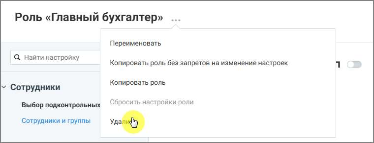

# 4.6.3.3.4. Удаление роли

> Трассировка: PDF §4.6.3.3.4 · сквозные стр. 459 · источники: ч.1 `kb/sources/mango-lk-manual/LK_manual_v-123.pdf` с.459.

Удалить можно только пользовательские роли. Системные роли удалить нельзя. Чтобы удалить роль: • откройте список ролей • выберите роль, которую необходимо удалить • выберите действие Удалить роль • подтвердите удаление

Рисунок 6. Удаление роли После удаления роль становится недоступной для назначения пользователям.
