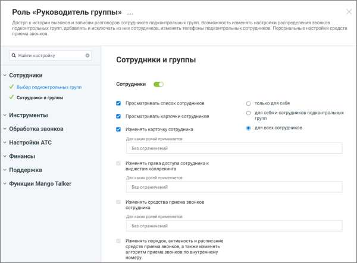
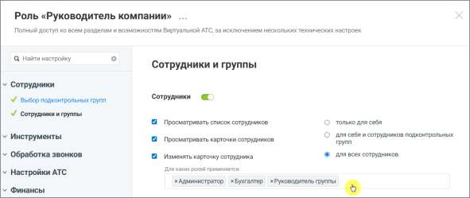
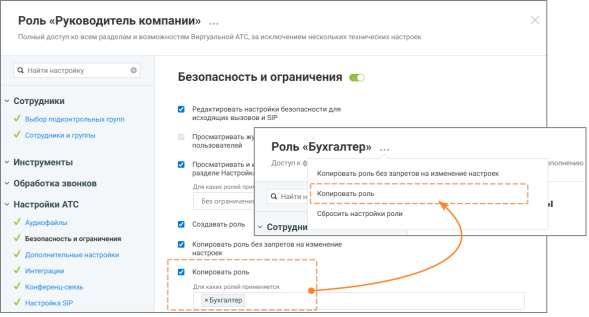

# 4.6.3.3.6. Настройка прав доступа роли

> Трассировка: PDF §4.6.3.3.6 · сквозные стр. 460-465 · источники: ч.1 `kb/sources/mango-lk-manual/LK_manual_v-123.pdf` с.460-465.

Права доступа роли определяют, какие действия доступны пользователям с этой ролью и к каким разделам системы они могут получить доступ. Если право включено - выполнение соответствующего действия разрешено. Если право отключено - выполнение функции недоступно. При настройке некоторых прав доступа также можно указать, над сотрудниками с какими ролями разрешено выполнение действия. Для этого выбираются роли целевых сотрудников — действие будет доступно только в том случае, если сотрудник, на которого оно направлено, обладает ролью из списка ролей параметра доступа. Если установлено значение «Без ограничений», то принадлежность роли сотрудника, над которым производится действие не проверяется. Настройка прав доступа выполняется при создании роли или при редактировании существующей роли.

Рисунок 8. Настройка прав доступа для роли Чтобы изменить права доступа роли: • откройте раздел Настройки АТС → Безопасность и ограничения → Настройка доступа • выберите роль, права доступа которой необходимо изменить • включите или отключите необходимые права доступа и ограничения • настройте параметры прав доступа (при необходимости) • нажмите Сохранить. внимание После сохранения изменения применяются ко всем пользователям, которым назначена эта роль. Некоторые права доступа могут зависеть от других прав. В этом случае изменение одного права может автоматически изменить состояние другого права. При редактировании прав в интерфейсе Личного кабинета ВАТС в таких случаях отображаются подсказки.

Также часть прав может быть недоступна для изменения и отображаться в режиме только чтения. Такие права устанавливаются системой и не могут быть изменены вручную. Статусы прав доступа в разрезе возможностей подключения:

- право доступно, но не подключено

- право доступно и подключено

- возможность подключения зависит от активности какого-либо из предыдущих прав доступа

- право недоступно для подключения

- право подключено и недоступно для отключения

Иконка рядом с названием раздела означает, что для роли включена возможность доступа хотя бы к одной функции этого раздела. Если иконка отсутствует, доступ к функциям раздела для данной роли не предоставлен.

Рисунок 9. Иконки доступа к разделам

Переключатель состояния прав доступа раздела может иметь следующий вид:

- все права доступа к разделу для данной роли отключены

- права доступа доступны для подключения

- все права доступа отключены и недоступны для подключения

- все права доступа включены и недоступны для отключения Гибкая настройка прав доступа с учетом ролей объекта Существует возможность тонкой настройки для ряда существующих опций. При активации некоторых разрешений можно ограничить их действие не только уровнем влияния (на себя, подчиненных или всех), но и конкретным списком ролей объекта. Под объектом подразумевается роль пользователя, над которым производится действие, ограниченное доступом. Как это работает: вы включаете настройку (например, «Изменять карточку сотрудника») и выбираете уровень влияния «Для всех сотрудников». Дополнительно вы можете указать, для сотрудников с какими ролями будет доступно это действие. При настройке вам доступны следующие варианты: • Без ограничений — настройка активна для всех сотрудников, независимо от их роли. • Выбор одной или нескольких ролей из списка — действие будет разрешено только в случае, если сотрудник, в отношении которого выполняется действие, обладает ролью из заданного списка параметров права доступа. Для сотрудников с другими ролями данное действие будет запрещено.

Рисунок 10. Роль «Руководитель компании», настройка «Изменять карточку сотрудника»

На рисунке 11 показан пример настройки прав доступа: пользователь с ролью Руководитель компании может изменять карточки только тех сотрудников, чьи роли указаны в настройках (Администратор, Бухгалтер, Руководитель группы). Изменение карточек сотрудников с иными ролями для него недоступно.

Рисунок 11. Роль «Руководитель компании». Настройка «Копировать роль» доступна для изменения Руководителем компании только для роли «Бухгалтер» На рисунке 12 показан пример настройки роли «Руководитель компании». У этой роли есть полный доступ ко всем разделам системы, а в блоке настроек «Копировать роль» задано ограничение: руководитель может копировать только роль Бухгалтер. Это означает, что сотрудник с ролью «Руководитель компании»: • сможет создать копию роли «Бухгалтер» (кнопка копирования будет активна); • не сможет скопировать никакие другие роли — при попытке это сделать система покажет уведомление об отсутствии прав.

Рисунок 12. Роль «Руководитель компании», настройки. На рисунке 13 пользователь с ролью Руководитель кампании имеет доступ к редактированию карточки сотрудника пользователям только с ролью Руководитель группы. Данная настройка (задание списка ролей) позволяет ограничивать не только список прав доступа, но и уточнять роль или перечень ролей объекта, над которым планируются действия, ограниченные правом доступа.
