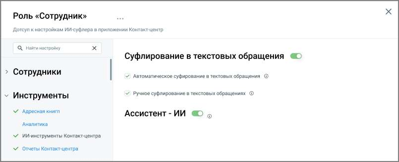

# Доступ к ИИ-инструментам Контакт-центра

> Трассировка: PDF §4.6.3.3.6 · сквозные стр. 465-466 · источники: ч.1 `kb/sources/mango-lk-manual/LK_manual_v-123.pdf` с.465-466.

В настройках роли доступен раздел «ИИ-инструменты КЦ», который позволяет управлять доступом сотрудников с этой ролью к инструментам искусственного интеллекта в приложении Контакт-центр. Раздел отображается в настройках роли всегда, но становится активным только при наличии хотя бы одной из услуг «Суфлер- ИИ» или «Ассистент-ИИ», подключённых на тарифе. Если ни одна из услуг не подключена, раздел недоступен для настройки.

Внутри раздела доступны следующие настройки: • Ассистент-ИИ — включает для роли доступ к ассистенту-ИИ, который отвечает на вопросы сотрудника на основании базы знаний компании. • Суфлирование в текстовых обращениях (ручное) — включает для роли возможность самостоятельно запросить у суфлера-ИИ ответ по части или всей переписке с клиентом. • Автоматическое суфлирование в текстовых обращениях — включает для роли автоматическое появление подсказок суфлера-ИИ во время переписки с клиентом. При включении этой настройки автоматически включается и ручное суфлирование; отключить ручное суфлирование при включённом автоматическом нельзя. примечание Каждая из настроек доступна только при подключённой на тарифе соответствующей услуге («Суфлер-ИИ» или «Ассистент-ИИ»).
