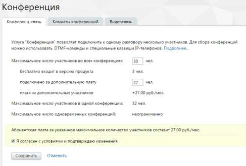

# 4.6.4.1. Конференц-связь

> Трассировка: PDF §4.6.4.1 · сквозные стр. 471-472 · источники: ч.1 `kb/sources/mango-lk-manual/LK_manual_v-123.pdf` с.471-472.

Инструмент служит для управления количеством собеседников при конференциях. По умолчанию в одной конференции может участвовать до 8 человек, при подключении дополнительной услуги – 32. Вы можете изменить количество участников конференции, которое бесплатно входит в версию продукта. Для этого введите новое число в поле «Максимальное число участников во всех конференциях». После ввода ниже вы увидите, сколько участников будет подключено дополнительно, а также стоимость их подключения.

Для сохранения изменений установите флаг «Я согласен с условиями и подтверждаю изменения» и нажмите Сохранить. Команды для управления конференцией Для создания нажмите # * или # # на клавиатуре телефона во время разговора, и Виртуальная АТС установит первого собеседника на удержание. Наберите номер следующего участника. Если он не отвечает — нажмите # # для возврата к разговору. При дозвоне до нужного номера нажмите # *. Конференция создана.

Для добавления нового участника нажмите # * или # #. Виртуальная АТС временно выводит вас из конференции. Далее выполняйте те же действия, что и при создании конференции. Для выхода из режима конференции повесьте трубку телефона. внимание Если организатор конференции отключается, то конференция завершается для всех участников и вызовы завершаются.
