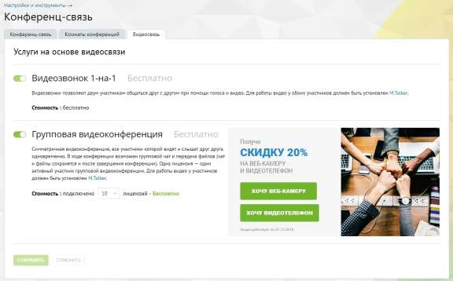

# 4.6.4.3. Видеосвязь

> Трассировка: PDF §4.6.4.3 · сквозные стр. 474-476 · источники: ч.1 `kb/sources/mango-lk-manual/LK_manual_v-123.pdf` с.474-476.

Инструмент служит для управления услугами «Видеозвонки» и «Групповая видеоконференция».

Пользователям предлагаются следующие возможности: • Видеозвонки 1-на-1 — общение двух участников. Услуга предоставляется бесплатно и не отключается. • Групповая видеоконференция — симметричная видеоконференция, все участники которой видят и слышат друг друга одновременно. В ходе конференции возможен групповой чат и передача файлов (чат и файлы сохранятся и после завершения конференции). Максимальное число участников одной конференции зависит от количества подключенных лицензий, и не может превышать 100 человек. Услуга предоставляется бесплатно. Внимание Для работы видео у каждого из участников должен быть установлен M.Talker. По умолчанию услуга «Групповая видеоконференция» отключена. Для подключения услуги следует установить переключатель в положение «Включено» и указать нужное количество лицензий. Впоследствии количество лицензий можно изменить. Для сохранения изменений следует установить флаг «Я принимаю условия…» и нажать кнопку Сохранить.

