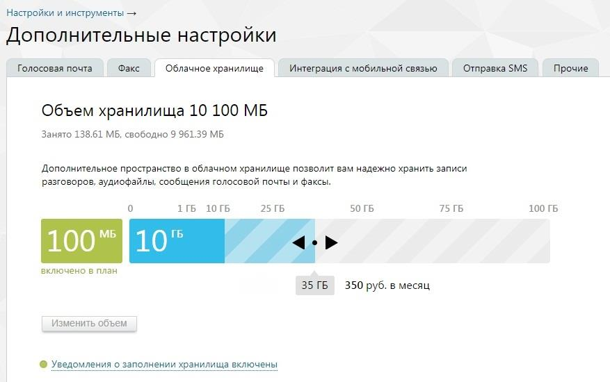
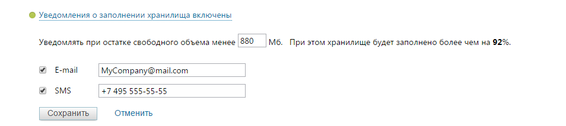
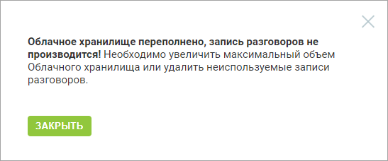
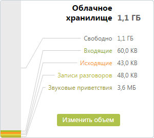

# 4.6.5.2. Облачное хранилище

> Трассировка: PDF §4.6.5.2 · сквозные стр. 483-485 · источники: ч.5 `kb/sources/mango-lk-manual/LK_manual_v-121часть-5.pdf` с.79-81.

Виртуальная АТС хранит все данные (сообщения, записи разговоров, аудиофайлы) и настройки в защищенном персональном облачном хранилище, что позволяет не беспокоиться за их сохранность. Бесплатно предоставляемый вам объем хранилища отображается на шкале зеленым цветом (см. рисунок ниже), дополнительно оплаченный — голубым. Для изменения доступного пространства облачного хранилища переместите ползунок в нужное положение. При перетаскивании ползунка под ним отображаются текущий выбранный объем и стоимость ежемесячной абонентской платы за пользование хранилищем. Подтвердите операцию, нажав на кнопку «Изменить объем».

Для того, чтобы оперативно узнать о достижении критического объема облачного хранилища, щелкните по ссылке «Уведомления о заполнении хранилища включены» и

включите отправку SMS-уведомлений установив соответствующий флаг. Отправка уведомлений на электронную почту включена по умолчанию.

В случае, когда остаток свободного объема достигнет указанного критического значения и/или остаток составит 5 Мб, на заданный телефонный номер и/или электронный почтовый ящик будет автоматически отправлено соответствующее сообщение. Также при достижении указанных значений при входе в Личный кабинет или при переходе на главную страницу на экране будет отображено сообщение вида:

Информация об общем и свободном объеме хранилища дублируется при помощи виджета на главной странице текущего продукта ВАТС.

При подключении услуги «Перезаписывать самые старые звонки, если превышен объем хранилища» система автоматически будет заменять на новые звонки те записи, которые хранятся в архиве дольше всего, обеспечивая тем самым бесперебойную запись новых разговоров.

