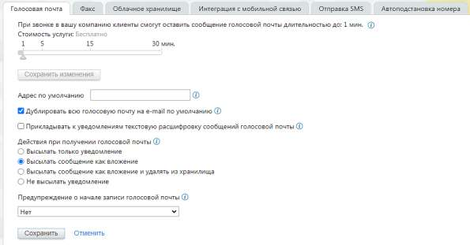

# 4.6.5.1. Голосовая почта

> Трассировка: PDF §4.6.5.1 · сквозные стр. 476-478 · источники: ч.1 `kb/sources/mango-lk-manual/LK_manual_v-123.pdf` с.476-478.

Укажите максимальную длительность для сообщения голосовой почты, переместив ползунок в нужное положение на шкале. Нажмите кнопку «Сохранить изменения» непосредственно под шкалой. В открывшейся форме выберите вариант «Подтвердить изменение». Введите адрес электронной почты, на который высылаются уведомления о сообщениях, если указана переадресация на голосовую почту. Этот адрес будет использоваться для всех сообщений, кроме тех, для которых в схеме переадресации в явном виде не указан

отдельный адрес. Значение параметра по умолчанию — адрес электронной почты, который вы указали при регистрации в качестве клиента MANGO OFFICE. При установленном флаге «Дублировать всю голосовую почту на e-mail по умолчанию» все уведомления о получении голосовой почты отправляются также и на адрес, указанный с использованием параметра «Адрес по умолчанию». При установленном флаге «Прикладывать к уведомлениям текстовую расшифровку сообщений голосовой почты» всплывает уведомление о подключении услуги Распознавание записей голосовой почты, с указанием стоимости.

Параметр «Действия при получении голосовой почты» позволяет выбрать, как Виртуальная АТС будет обрабатывать поступившие голосовые сообщения: • Высылать только уведомление - сообщение сохраняется в облачном хранилище и доступно в Личном кабинете, а на указанный адрес электронной почты отправляется письмо с уведомлением. • Высылать сообщение как вложение - сообщение сохраняется в облачном хранилище и доступно в Личном кабинете, а также прикрепляется к письму с уведомлением, отправляющемуся на указанный адрес электронной почты. Этот режим установлен по умолчанию. • Высылать сообщение как вложение и удалять из хранилища - при получении сообщения оно прикрепляется к письму с уведомлением, отправляющемуся на указанный адрес электронной почты, а затем удаляется из облачного хранилища и становится недоступным в Личном кабинете.

совет Мы не рекомендуем включать этот режим, так как в случае проблем с почтовым ящиком вы можете утратить доступ к сообщениям голосовой почты. • Не высылать уведомление - сообщение сохраняется в облачном хранилище и доступно в Личном кабинете. При выборе любого из описанных выше режимов письма с уведомлениями о поступлении сообщений отправляются на адреса электронной почты, указанные: • в настройках сотрудника, которому оставлено сообщение; • в соответствующих правилах обработки вызова на схеме переадресации. Если такие адреса не указаны, то письма отправляются на адрес по умолчанию (указанный с использованием параметра «Адрес по умолчанию» в группе «Голосовая почта»). С помощью выпадающего списка «Предупреждение о начале записи голосовой почты» вы можете установить предупреждение, которое будет проигрываться позвонившему перед началом записи голосового сообщения (по умолчанию «Оставьте ваше сообщение после сигнала»). После воспроизведения этого предупреждения всегда звучит краткий тоновый сигнал начала записи. Если в списке установить значение «Нет», то будет проигрываться только краткий тоновый сигнал начала записи.
