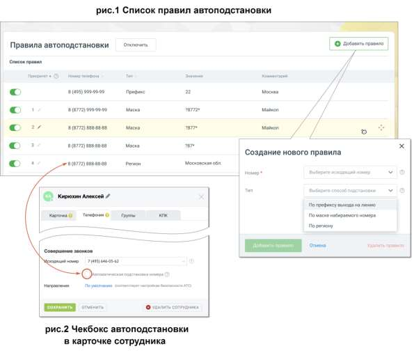

# 4.6.5.5. Автоподстановка номера

> Трассировка: PDF §4.6.5.5 · сквозные стр. 484-486 · источники: ч.1 `kb/sources/mango-lk-manual/LK_manual_v-123.pdf` с.484-486.

Данная вкладка позволяет настроить правила подстановки номеров и совершать исходящие звонки с номера того региона, куда совершается звонок, независимо от месторасположения оператора. После ознакомления с условиями подключения услуги, нажмите кнопку Подключить. На вкладке размещается список существующих правил автоподстановки. Добавьте новое правило автоподстановки номера, кликнув по кнопке добавить правило. В открывшемся окне выберите: • Исходящий номер - выбирается из списка доступных сотруднику номеров, подключенных к ВАТС; • Тип – способ подставновки: по префиксу, по маске, по региону.

• Префикс, маска, регион - Нажав на пиктограмму ознакомьтесь с пояснениями к каждому из вариантов, и введите необходимые данные. • Комментарий – добавьте комментарий для данного правила. Окно не является обязательным для заполнения.

Если один и тот же номер подпадет под несколько разных масок или же входит в регион и удовлетворяет маске, то в качестве исходящего, будет использован номер, находящийся выше в списке приоритета. Изменить приоритет можно, нажав на

пиктограмму правила левой кнопкой мыши и переместив его вверх. Правила с типом «префикс» не имеют приоритета. Пример 1. Настройки правил с типом «маска». 7495\d* - правилу удовлетворяют все номера, начинающиеся с 7495; 5\d{7} - правилу удовлетворяет любой 11- значный номер, начинающийся с 7495; 7495\d*|7499\d* - правилу удовлетворяют все номера, начинающиеся с 7495 или 7499; 7495[5-6][5-6][5-6][5-6][5-6][5-6] - правилу удовлетворяют все номера, в диапазоне от 7495-55-55-55 до 7495-66-66-66.

Пример 2. Переводы вызова.

| При переводах вызова сотрудник А, у которого включена автоподстановка АОН |
| --- |
| (Автоматическое Определение Номера) звонит сотруднику Б. Сотрудник Б |
| переводит вызов на внешний региональный номер. При переводе линия |
| подменяется на линию, соответствующую внешнему региону. Аналогично при |
| переадресации по типу «маска». |
