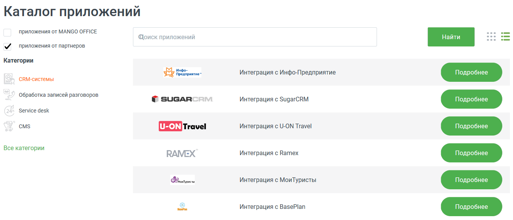

# 4.6.7.2. Решения партнеров

> Трассировка: PDF §4.6.7.2 · сквозные стр. 501-502 · источники: ч.5 `kb/sources/mango-lk-manual/LK_manual_v-121часть-5.pdf` с.97-98.

Данный инструмент предназначен для интеграции MANGO OFFICE с программными разработками партнеров. В боковом меню выберите поставщика и категорию приложения.

Для подключения выберите нужную систему из выпадающего списка и нажмите Подробнее. Ознакомьтесь с условиями подключения и нажмите Подключить. Для настройки подключения приложения следуйте приведенной инструкции.

Проверка корректности подключения осуществляется нажатием на кнопку Проверить статус интеграции в разделе Мои интеграции. Результат проверки отображается справа от кнопки. При необходимости настройки интеграции с другими системами повторите вышеописанные действия.
