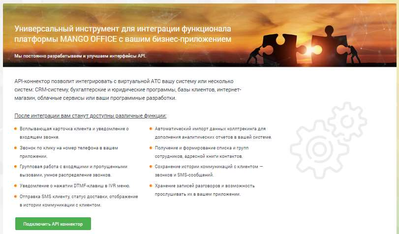
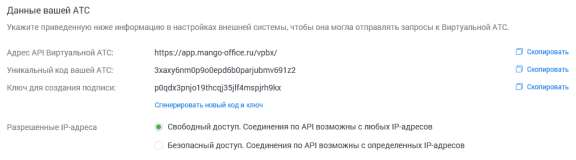
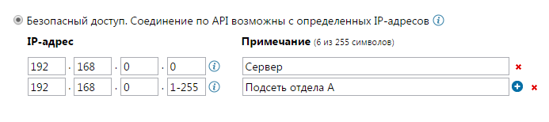
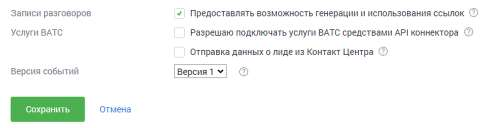
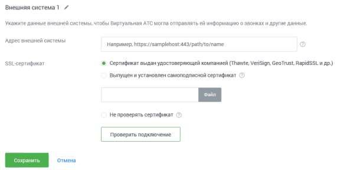
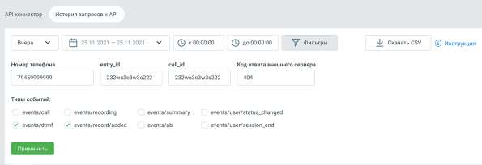
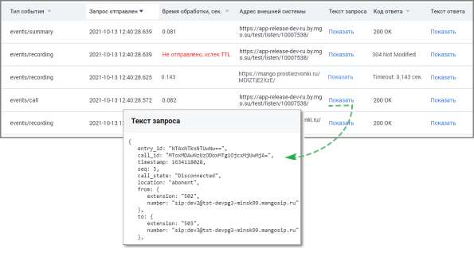

# 4.6.7.3. API Коннектор

> Трассировка: PDF §4.6.7.3 · сквозные стр. 499-505 · источники: ч.1 `kb/sources/mango-lk-manual/LK_manual_v-123.pdf` с.499-505.

Используйте настройку «API Коннектор» для подключения к Виртуальной АТС различных внешних систем, например, таких как CRM или интернет-магазины.

Вкладка API Коннектор Перейдите на вкладку API Коннектор, ознакомьтесь с возможностями API MANGO OFFICE и нажмите кнопку Подключить API Коннектор.

В открывшемся окне заполните поля формы: Данные вашей АТС В этом блоке приведены данные вашей Виртуальной АТС, которые следует указать в настройках внешней системы.

Уникальный код и ключ для создания подписи генерируются автоматически. При необходимости вы можете сгенерировать новые код и ключ, нажав соответствующую кнопку. После изменения данных следует обновить настройки внешней системы, подключенной по API. При настройке IP-адресов, которым разрешен доступ по API, мы рекомендуем использовать безопасный доступ с указанием так называемых «белых» IP-адресов.

Для этого установите переключатель в соответствующее положение и составьте список IP-адресов, с которых будет разрешен доступ.

Дополнительные параметры API

При включенной настройке «Записи разговоров» внешней системе предоставляется возможность генерации и использования прямых ссылок для скачивания и воспроизведения записи разговоров. При включенной настройке «Услуги ВАТС» при вызовах методов API подключаются соответствующие услуги (к примеру алгоритм дозвона), если они входят в текущий тарифный план. В журнале действий в ЛК работа с услугами (в том числе сотрудниками, группами) через API отображается от имени виртуального пользователя "API конструктор". При включенной настройке «Отправка данных о лиде из Контакт Центра» внешней системе передаются данные лидов из Контакт Центра MANGO OFFICE. Внимание При включенной настройке записи доступны без авторизации в Личном кабинете, что может привести к несанкционированному скачиванию записей. Данные внешней системы Выберите имя внешней системы. В поле для ввода адреса внешней системы указывается адрес внешней системы в виде имени сервера, порта и url-пути. В качестве имени сервера можно использовать как доменное имя, так и IP-адрес. Укажите тип SSL-сертификата. Если вы используете самоподписной сертификат, то установите переключатель в соответствующее положение и при помощи кнопки «Обзор» укажите путь к корневому файлу сертификата. Впоследствии загруженный сертификат можно заменить или удалить.

Внимание При выборе варианта «Не проверять сертификат» проверка подлинности соединения внешней системы с Виртуальной ВАТС не выполняется. Существует угроза безопасности данных. При наличии подключенной услуги с установленным ограничением (>1) отображается кнопка Добавить систему для добавления дополнительных внешних систем. При нажатии кнопки добавляется блок «Данные внешней системы» с аналогичным набором полей. Внимание При подключении нескольких внешних систем рассылка осуществляется последовательно на каждый из адресов, согласно настройкам Личного кабинета. Настройка IP-адресов осуществляется для всех внешних систем одновременно. совет При использовании групповых IP-адресов вы можете избежать необходимости ввода каждого отдельного адреса, применяя символы «*» и «-». Их назначение и

примеры использования приведены в справке, вызываемой при наведении курсора

на значок . Ограничения и фильтры на отправку данных по событиям API Настроить отправку событий по звонкам – если чекбокс отмечен, доступны три дополнительных настройки: o Не отправлять уведомления о промежуточном состоянии вызова и его параметрах (событие events/call) - если включен, во внешнюю систему не отправляются данные из API по этапам совершения звонка; o Не отправлять уведомления с итоговой информацией по звонку (событие events/summary) - если включен, во внешнюю систему не отправляются данные из API с информацией о звонке; o Исключить отправку событий для номеров (выбрать) - звонковые события API не отправляются во внешнюю систему, если в них участвуют выбранные номера. Не пробрасывать идентификатор SIP_Call_ID из внешней системы – если чекбокс отмечен, то в звонковых событиях API не передается идентификатор SIP_Call_ID, полученный от внешней системы при входящих звонках. Не отправлять уведомления о нажатиях DTMF-клавиш клиентом в IVR (событие events/dtmf) – если чекбокс отмечен, то во внешнюю систему не передаются данные о нажатиях клиентом клавиш в меню IVR в тональном режиме. Не отправлять уведомления о состоянии записи разговоров (событие events/recording) – если чекбокс отмечен, то во внешнюю систему не передаются данные о каждом новом состоянии записи разговора. Не отправлять события о готовности для скачивания файла записи разговора (событие events/record/added) – если чекбокс отмечен, то во внешнюю систему не передаются данные о возможности скачать файл записи разговора. Не отправлять информацию о статусе доставки SMS-сообщений (событие events/sms) – если чекбокс отмечен, то во внешнюю систему не передаются данные о доставке СМС клиенту. Не отправлять информацию о событиях в Адресной книге на указанный адрес внешней системы (события events/ab) – если чекбокс отмечен, сервис API не информирует внешнюю систему об изменениях в адресной книге MANGO OFFICE. Не отправлять события о завершении процесса распознавания тематик в телефонных разговорах (событие events/record/tagged) - если чекбокс отмечен, сервис API не информирует о завершении процесса распознавания тематик звонка. После ввода всех данных нажмите кнопку «Проверить подключение». Если все поля заполнены корректно, то запускается процедура проверки соединения Виртуальной АТС и внешней системы по API. Если поля заполнены неправильно, на экране отобразится подробное сообщение, указывающее на ошибку.

Аналогичная проверка выполняется при нажатии на кнопку «Сохранить». Сохранение данных выполняется только в том случае, когда все данные указаны правильно и соединение установлено. Вкладка История запросов к API Вкладка содержит набор фильтров для поиска запросов к API и событий для клиента. Внимание Услуга доступна на версиях Виртуальной АТС, начиная с версии «Расширенная».

Для отбора данных доступны фильтры: Период – варианты выпадающего списка: последний час, сегодня, вчера, последние три дня, текущая неделя, текущий месяц, произвольный период. Доступны данные за период не более двух месяцев. Время – выбор времени осуществления запроса. По клику на кнопку «Фильтры» ображаются поля дополнительной фильтрации: Номер телефона – фильтрует данные по номеру телефона, в том числе по частичному совпадению строки с введёнными данными. entry_id – фильтрует данные по параметру entry_id в API ВАТС, в том числе по частичному совпадению строки идентификатора с введёнными данными. call_id – фильтрует данные по параметру call_id в API ВАТС, в том числе по частичному совпадению строки идентификатора с введёнными данными. Код ответа внешней системы – фильтрует данные по числовому коду ответа сервера внешней системы. Допускается только ввод цифр, не более 3 знаков. Чекбоксы Типы событий – events/call, events/summary, events/dtmf, events/recording, events/record/added, events/record/tagged, events/sms, events/ab, events/user/status_changed, events/user/session_end.

Нажатие на кнопку «Скачать CSV» открывает стандартное окно экспорта таблицы детализации в формате CSV (Excel). Нажатие на кнопку «Применить» открывает окно выдачи с применением всех выбранных на странице фильтров. Окно выдачи содержит:

Тип события – список событий в соответствии с выбранными в фильтрах чекбоксами. Запрос отправлен – дата и время отправки запроса от API ВАТС клиенту. Время обработки – время обработки запроса от API ВАТС сервером клиента. Адрес внешней системы – адрес внешней системы, на который API отправляет событие. Текст запроса – клик на кнопку «Показать» открывает окно с полным текстом POST- запроса со стороны API к внешней системе. Код ответа – содержит код ответа сервера клиента на http-запрос от API ВАТС с расшифровкой. Например: "200 OK", "404 Not Found", "405 Method Not Allowed". Текст ответа – клик на кнопку «Показать» открывает окно с полным текстом ответа на POST-запрос от API ВАТС. Предусмотрен экспорт файла истории в формате CSV. После клика на кнопку «Скачать CSV» будет открыто стандартное диалоговое окно браузера, позволяющее сохранить файл.
