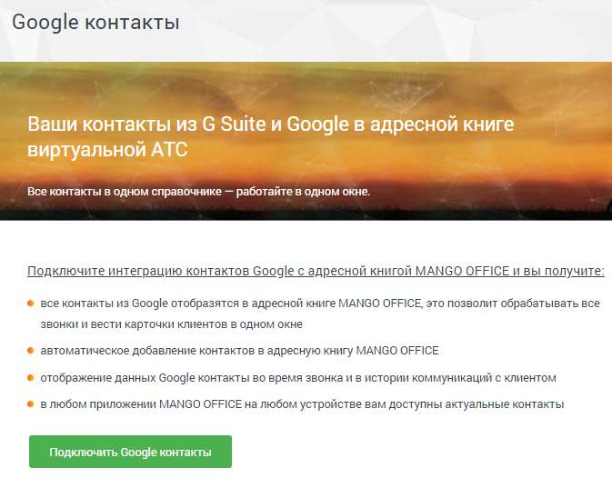

# 4.6.7.4. Gооgle контакты

> Трассировка: PDF §4.6.7.4 · сквозные стр. 505-507 · источники: ч.1 `kb/sources/mango-lk-manual/LK_manual_v-123.pdf` с.505-507.

Данный инструмент предназначен для настройки подключения и интеграции вашей ВАТС с сервисом Gsuite и Google контакты. Интеграция систем позволит добавлять

контакты из GSuite в адресную книгу MANGO OFFICE и отображать информацию во время звонка.

Для интеграции с сервисом Gsuite и Google контакты: 1. Установите флаг «Я принимаю условия…» и нажмите кнопку Подтвердить. 2. В стандартной форме авторизации Google выберите аккаунт и авторизуйтесь. 3. В открывшейся форме выберите «Дополнительные настройки», затем «Перейти на страницу "mango-office.ru" (небезопасно)» 4. Разрешите приложению интеграцию доступ на чтение контактов. Закройте вкладку и вернитесь в Личный кабинет. 5. Нажмите кнопку Проверить статус интеграции. Теперь при появлении новых контактов в GSuite, они будут автоматически (с некоторой задержкой) добавляться в адресную книгу Виртуальной АТС

