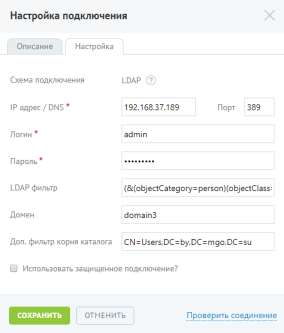

# Шаг 1. Подключение к LDAP-серверу

> Трассировка: PDF §4.6.7.5 · сквозные стр. 508-510 · источники: ч.1 `kb/sources/mango-lk-manual/LK_manual_v-123.pdf` с.508-510.

На данной вкладке осуществляется настройка подключения. При подключении по LDAP следует заполнить набор полей:

Поля, отмеченные символом «*», являются обязательными для заполнения. При необходимости использования защищенного подключения следует установить соответствующий флаг и выбрать сертификат. После ввода всех обязательных полей становится доступной кнопка Проверить соединение. При нажатии кнопки выполняется проверка наличия доступа к системе клиента по указанным настройкам. В результате успешного подключения указывается значение «Подключено». Также при успешном подключении на вкладке «Подключение по LDAP» в строке «Статус подключения» отобразится зелёная пиктограмма.

При корректной настройке становится доступным следующий шаг.

