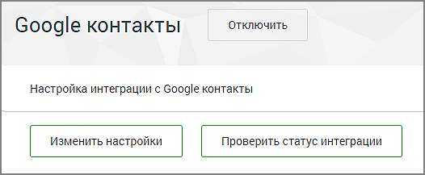
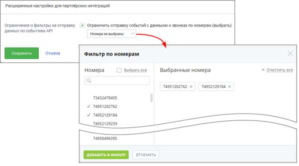

# 4.6.7.8. Мои интеграции

> Трассировка: PDF §4.6.7.8 · сквозные стр. 518-520 · источники: ч.1 `kb/sources/mango-lk-manual/LK_manual_v-123.pdf` с.518-520.

В подразделе меню Мои интеграции отображаются блоки настроек для всех подключенных интеграций пользователя. Проверка корректности подключения осуществляется последовательным нажатием на кнопки Настроить и, в открывшемся окне настроек, Проверить статус интеграции. Результат проверки отображается справа от кнопки.

Для отключения интеграции нажмите Отключить напротив наименования системы. Также в подразделе Мои интеграции размещаются • Данные для настройки интеграции: уникальный код ВАТС, ключ для создания подписи и др. • Расширенные настройки для партнёрских интеграций: ограничения и фильтры на отправку (доступны, если на ВАТС подключена интеграция с хотя бы одной системой через партнёра "Простые звонки").

Отметка в чекбоксе открывает окно фильтрации отправки событий API. Звонковые события API не отправляются во внешнюю систему, если в них участвуют выбранные номера.

